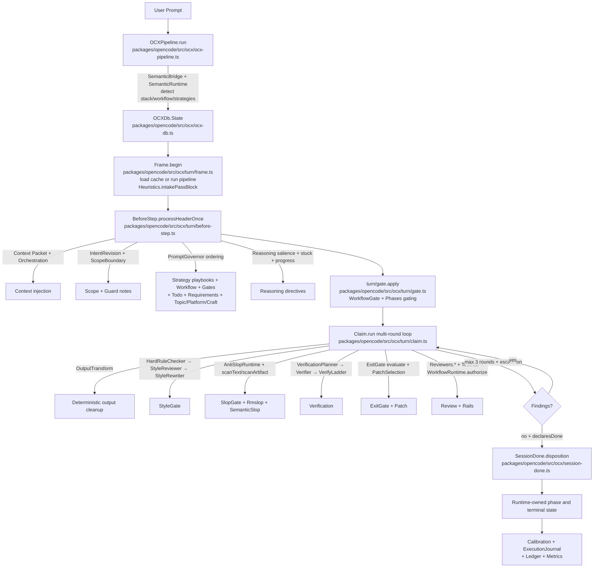
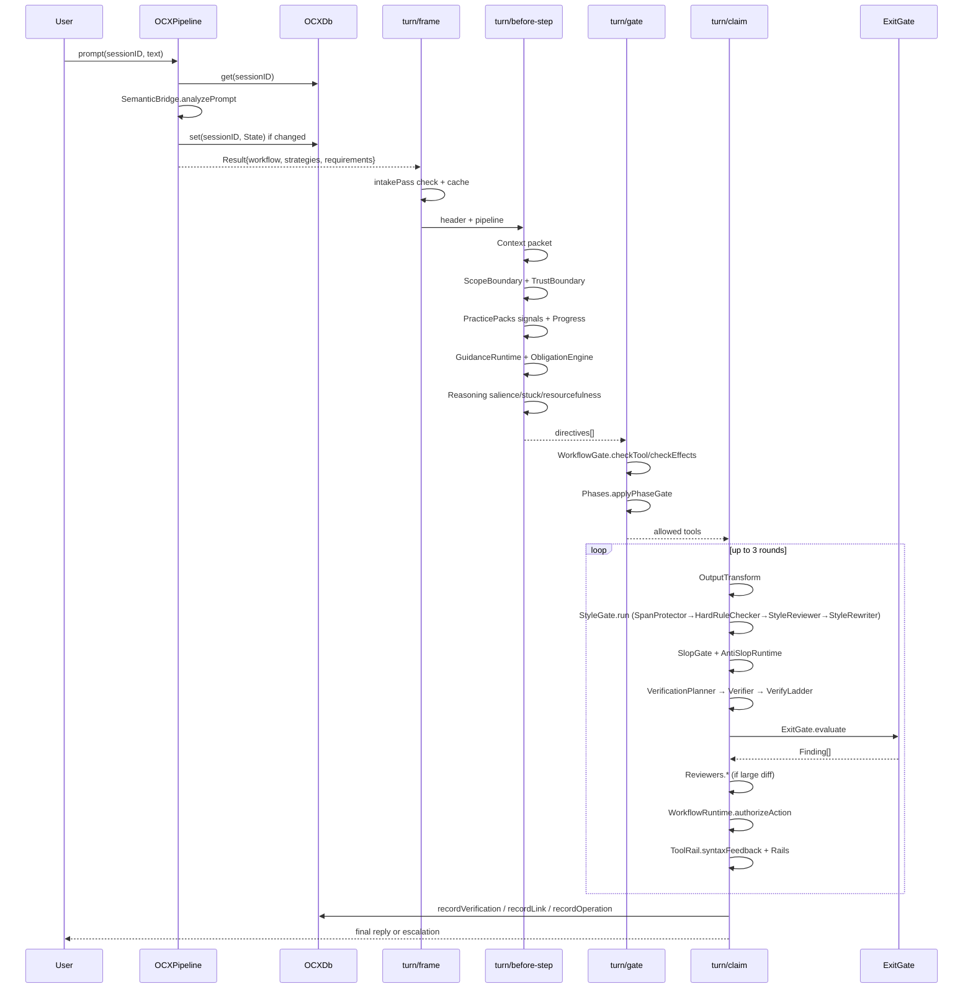
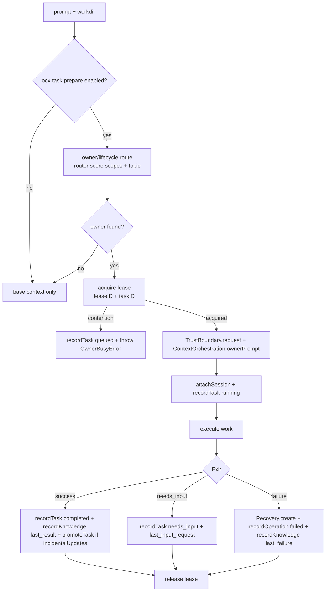
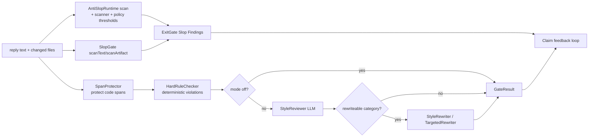
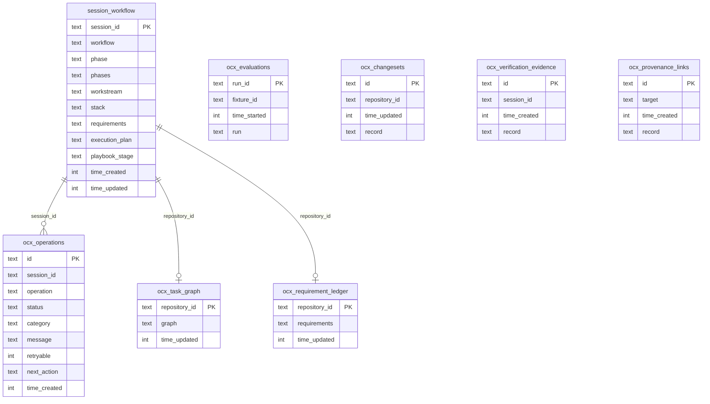

# OCX Pipeline and Systems

OpenCode-X (OCX) is an engineering layer built on top of OpenCode that adds a structured pipeline, quality gates, codebase awareness, and anti-slop enforcement to coding-agent workflows. This document describes every OCX system, its responsibilities, and how it differs from the base OpenCode runtime.

## Table of Contents

- [Overview](#overview)
- [Pipeline Core](#pipeline-core)
- [Work Graph Runtime](#work-graph-runtime)
- [Persistence and Session State](#persistence-and-session-state)
- [Turn Lifecycle](#turn-lifecycle)
- [Activity System](#activity-system)
- [Workflow System](#workflow-system)
- [Workflow Runtime](#workflow-runtime)
- [Workflow Gate](#workflow-gate)
- [Scope Enforcement](#scope-enforcement)
- [Strategy Playbooks](#strategy-playbooks)
- [Prompt Playbooks and Stack Adapters](#prompt-playbooks-and-stack-adapters)
- [Context System](#context-system)
- [Semantic System](#semantic-system)
- [Header and Intent](#header-and-intent)
- [Anti-Slop and Style Gate](#anti-slop-and-style-gate)
- [Verification Ladder](#verification-ladder)
- [Exit Gate and Claim System](#exit-gate-and-claim-system)
- [Owner System](#owner-system)
- [Memory System](#memory-system)
- [Eval System](#eval-system)
- [Quality Gates](#quality-gates)
- [Ledger and Trace](#ledger-and-trace)
- [Practice Packs and Playbooks](#practice-packs-and-playbooks)
- [Codebase Services](#codebase-services)
- [Design System](#design-system)
- [Cognitive System](#cognitive-system)
- [Engineering Knowledge](#engineering-knowledge)
- [Reasoning System](#reasoning-system)
- [Reference System](#reference-system)
- [Tool Rail and Security Guards](#tool-rail-and-security-guards)
- [Core Utilities and Guards](#core-utilities-and-guards)
- [TUI](#tui)
- [Prompt Entry Point and Governance](#prompt-entry-point-and-governance)
- [Architecture Diagram](#architecture-diagram)
- [Session Touch-Points](#session-touch-points)
- [Commit Convention](#commit-convention)
- [Module Layout](#module-layout)
- [Current Source Map](#current-source-map)

---

## Overview

OpenCode is a coding-agent runtime: it manages sessions, provider turns, tool execution, compaction, and context assembly. OCX adds a structured workflow pipeline, durable planning, context services, action gates, and verification around that runtime. The legacy provider-turn loop remains the execution path; the WorkGraph runtime adds durable work state alongside it.

OCX is implemented in the current checkout. `packages/opencode/src/ocx/` contains the runtime modules and prompt assets, `packages/tui/src/ocx/` contains the live activity and workflow UI, and the session integration is in `packages/opencode/src/session/`. The redesign specification is a roadmap for incremental improvements, not a description of an absent subsystem.

Key architectural differences from base OpenCode:

| Concern | OpenCode | OCX |
|---|---|---|
| Workflow | Free-form prompt/response | Prescribed phases with gates |
| Quality | No built-in enforcement | Style gate, anti-slop, exit gate, rails |
| Codebase awareness | Manual exploration | Context system with typed knowledge |
| Verification | Ad hoc | Verification ladder (lint/typecheck/test/build) + planner/verifier |
| Ownership | Session-level | Owner registry with leases and tasks |
| Memory | Session history only | Persistent memory store and failure library |
| Evaluation | Not built-in | Fixture-based eval with scoring |
| Intent | Implicit | Explicit header, intent analysis, and guarding |
| Scope | Unbounded | Scope evaluator, boundaries, and telemetry |
| Tool safety | Permissive | Tool rail, shell policy, trust boundary, mutation guard |

OCX file counts: 298 TypeScript modules and 43 prompt/reference assets under `packages/opencode/src/ocx/**`, plus 5 files under `packages/tui/src/ocx/**`, with touch-points in `session/` and `effect/`. See [Current Source Map](#current-source-map) for the feature-oriented index.

---

## Pipeline Core

**File:** `packages/opencode/src/ocx/ocx-pipeline.ts:1`

`OCXPipeline` is the top-level orchestrator. It takes a session ID and prompt, resolves the workflow, strategies, and requirements, and produces a `Result` that drives the entire turn.

### Key types

- **`Deps`** - Store and todo accessor
- **`RunInput`** - `sessionID` + `prompt`
- **`Result`** - `changed`, `polished`, `strategies`, `stack`, `workflow`, `notice`, `topic`, `todos`, `requirements`

### `run()` logic

1. Trim and measure the prompt. Prompts shorter than 8 characters take a "short path" returning an unchanged result with the current workflow state.
2. Load stored session state from the database (`OCXDb`).
3. Merge requirements from stored state and parsed from prompt text.
4. Call `SemanticBridge.analyzePrompt()` to detect stack, workflow, and strategies.
5. Resolve the workflow definition - use stored workflow if continuing, otherwise use the semantic inference.
6. Build the strategy set by combining semantic strategies, stack strategies, and workflow-specific strategies.
7. Persist updated state if anything changed.

### `directives()` function

Assembles the full prompt block injected into the model's context:

1. Loaded strategy playbooks (from `Strategy.load()`)
2. Workflow description rendered via `Workflow.render()`
3. Workflow gate capabilities via `WorkflowGate.render()`
4. TODO state block
5. Requirements block
6. Guard note
7. Topic context from `Knowledge.topicContext()`
8. Platform knowledge (fixed facts about the repo environment)
9. Craft knowledge (universal engineering rules)
10. Codegen rules (when workflow is `codegen` or `write` strategy is active)

### `applyToMessages()` / `promptText()`

Utility functions that extract and optionally mutate the last user message text after pipeline processing.

Also see `packages/opencode/src/ocx/heuristics.ts:1` which defines `CORE_STRATEGIES = ["quality","write","engineering","stack"]`, `KNOWN_INTENTS`, and `intakePassBlock()` (deprecated alias `contractPassBlock`). The heuristic supplies the intake directive; header processing, plan state, and mutation guards enforce the applicable contract at runtime.

---

## Work Graph Runtime

**Directory:** `packages/opencode/src/ocx/work-graph/`

The WorkGraph runtime is an additive representation of work. It models typed nodes, dependency edges, explicit revisions, and event-sourced reconciliation without replacing the legacy workflow, phase, plan, tool, prompt, activity, or TUI paths.

- `types.ts` - graph, node, edge, operation, effect, evidence, and event contracts. The operation catalog intentionally has no `codegen` operation.
- `reducer.ts` - bounded snapshot/event parsing, legal node transitions, dependency readiness, graph completion, replay, and stale activity rejection.
- `reconciler.ts` - applies compiler patches while preserving completed nodes and superseding obsolete work.
- `compiler.ts` - advisory inquiry recipe compilation for answer, explain, explore, research, diagnose, review, documentation, and planning requests.
- `runtime.ts` - per-session single-writer dispatch and shadow graph persistence.

The runtime flag `RuntimeFlags.ocxWorkGraph` controls the path and currently defaults on with the other OCX flags. It writes `ocx_work_graphs` and `ocx_work_events`; `session_workflow` remains the workflow-state authority while both representations coexist.

---

## Persistence and Session State

### `packages/opencode/src/ocx/ocx-db.ts:1` — OCX SQLite layer

Durable store at `~/.local/share/opencode/ocx/workflow.db` (via `Global.Path.data`). Tables:

- `session_workflow` — `session_id, workflow, phase, phases, workstream, stack, requirements, execution_plan, playbook_stage, time_created, time_updated`
- `ocx_operations` — failed/cancelled operations with `Operation` (`read|patch|task|cancel|partial`) and `Category` (`spec|env|agent|artifact|evaluator`)
- `ocx_task_graph` — per-repository `TaskGraph.Graph`
- `ocx_requirement_ledger` — per-repository requirement records
- `ocx_evaluations` — `Eval.RunRecord`
- `ocx_changesets` — `Changeset.Record`
- `ocx_verification_evidence` — `Evidence.Verification`
- `ocx_provenance_links` — `Evidence.LinkRecord`
- `ocx_work_graphs` — durable WorkGraph snapshots
- `ocx_work_events` — ordered WorkGraph events with sequence and idempotency keys

Exports `OCXDb.Store` interface (`get/set/clear/recordOperation/operations/getGraph/setGraph/getWorkGraph/workGraphEvents/saveWorkGraph/...`), `open()`, `memory()` (in-memory fallback for tests), `shared` (singleton Effect), `path()`. Handles WAL, busy_timeout, and column migrations. Dual driver: `bun:sqlite` or `node:sqlite`.

**State type** `OCXDb.State:1` includes `workflow, phase, phases, workstream, stack, done, requirements, plan, playbookStage`.

### `packages/opencode/src/ocx/ocx-session.ts:1` — Session inspector tool

`ocx_session` AI tool (read-only). Two views: `summary` (`renderSummary()` produces `SESSION id=... task=... workflow=... stage=... purpose=... legal=... blocked=... plan=... ws=... sp=...`) and `messages` (bounded snapshot of last 20 messages, each part truncated to 240 chars). Used by the model to inspect itself without mutation.

### `packages/opencode/src/ocx/ocx-task.ts:1` — Owner task preparation

`OwnerBusyError`, `OwnerTaskContext`, `prepare()` (routes prompt via `OwnerLifecycle.route`, acquires lease, records `queued` task on contention), `reusableSession()`, `attachSession()`, `execute()` (wraps work in `Effect.exit`, records `completed|failed|cancelled|needs_input`, promotes context via `ContextOrchestration.promoteTask` when `incidentalUpdates` on, releases lease). Integrates `TrustBoundary`, `ContextOrchestration`, and `declaresNeedsInput()`.

### Workflow phase authority

`WorkflowRuntime.authorizeAction()` and `authorizeActionWithStore()` reconcile evidence and capability policy against the current `OCXDb` state. Assistant prose and progress checkpoints do not mutate workflow phase. Authorized transitions are published after persistence.

### `packages/opencode/src/ocx/ocx-retry.ts:1` — Empty-response retry

Handles LLMs returning no `text-start`/`tool-input-start`/`tool-call`. Constants `EMPTY_RESPONSE_MAX_ATTEMPTS=3`, `continuePrompt(attempt)`. `drain({run, compacted, set})` taps LLM `Stream`, fails with `EmptyResponseError` if no output and not compacted, retries with schedule, calling `set()` to inject "Continue. Respond now.".

---

## Turn Lifecycle

The turn system lives under `packages/opencode/src/ocx/turn/` and coordinates the sequence of steps from receiving a prompt to producing a final reply.

### Stages

Defined in `packages/opencode/src/ocx/turn/types.ts:1`:

```ts
type Stage = "topic" | "optimize" | "thinking" | "workflow" | "guard" | "reasoning"
```

Each stage is announced via `publishActivity` to the UI, showing progress through the pipeline.

### Turn flow

1. **Begin** (`packages/opencode/src/ocx/turn/frame.ts:1:begin`) - Check if session is done, load cached pipeline result, or run `OCXPipeline.run()`. Set the contract pass heuristic. Publish workflow state.
2. **Process header** (`packages/opencode/src/ocx/turn/before-step.ts:1:processHeaderOnce`) - Merge header info with pipeline state, sync todos, inject context packets, progress directives, practice packs, build guard notes, slop gate directives, reasoning feedback, and stuck detection.
3. **Claim** (`packages/opencode/src/ocx/turn/claim.ts:1:run`) - The main action phase. Polishes the reply text (deterministic transforms via `OutputTransform`, then LLM polish), runs the style gate, scans for anti-slop advisories, runs the verification ladder, evaluates the exit gate, invokes the reviewer for large changes, and handles patch selection for failed checks.
4. **Gate** (`packages/opencode/src/ocx/turn/gate.ts:1:apply`) - Tool gating applied before each step. Removes mutation tools in early steps and gates tools by workflow phase capabilities via `WorkflowGate`.

### Turn state (`packages/opencode/src/ocx/turn/state.ts:1`)

A process-local Map of session-specific state, keyed by `${sessionID}:${userId}`:

- `pipeline` - The current pipeline result
- `contractPass` - The contract pass heuristic block
- `header` - Parsed session header
- `headerDone` - Whether the header has been processed once
- `todosSynced` - Whether todos have been synced from plan
- `extras` - Extra prompt directives
- `rounds` - Current claim round number
- `signature` - Finding signature for dedup across rounds
- `feedback` - Feedback to model from claim evaluation
- `practiceHits` / `practiceInjected` - Practice pack tracking
- `patchAttempts` - Whether patch selection was attempted
- `progressInjected` - Progress directive injection state
- `saliencePhase` - Salience directive phase tracking
- `reminderInjected` - Reminder injection state
- `todoStateSignature` - TODO state change tracking
- `contextInjected` - Context packet injection state

### Other turn files

- `packages/opencode/src/ocx/turn/escalation.ts:1` - Escalation messaging when max claim rounds exhausted with remaining findings.
- `packages/opencode/src/ocx/turn/header-tool.ts:1` - Installs the `ocx_header` tool that parses header JSON and validates it against `Header` schema.

### `packages/opencode/src/ocx/phases.ts:1`

Pure gate: `applyPhaseGate(tools, {gated})` strips mutation tools (`edit,write,multiedit,notebookedit,apply_patch,task`) when gated; `isMutationTool(name)`.

---

## Activity System

**Directory:** `packages/opencode/src/ocx/activity/`

Live UI activity projection for the TUI and logs.

- `packages/opencode/src/ocx/activity/types.ts:1` - Activity kind, owner, lease, and priority types.
- `packages/opencode/src/ocx/activity/runtime.ts:1` - Owns activity leases, canonical current projections, terminal milestones, and stage-to-title mapping.
- `packages/opencode/src/ocx/activity/selector.ts:1` - `selectPrimaryActivity()` picks the primary activity row to display.
- `packages/opencode/src/ocx/activity/index.ts:1` - Barrel re-export.

Also see TUI `packages/tui/src/ocx/activity-row.tsx:1` (`PrimaryActivityRow`) and `packages/tui/src/ocx/ocx-log.ts:1` (append-only `OcxLogEntry` history, `workflowLogEntries()`).

---

## Workflow System

**File:** `packages/opencode/src/ocx/workflow.ts:1`

A workflow defines a named sequence of phases that a session follows. Each phase has an `id`, `goal`, and optional `gate` (exit criterion).

### Workflow presets

| Workflow | Purpose | Phases |
|---|---|---|
| `feature` | Add or change behavior in existing code | explore → plan → implement → verify → commit |
| `greenfield` | Build something new from scratch | spec → design → scaffold → implement → verify → ship |
| `environment` | Inspect and change a host/runtime safely | inspect → plan → apply → verify |
| `codegen` | Generate, refactor, or edit code | context → contract → codegen → selfreview → verify → commit |
| `debugging` | Find and fix a bug by evidence | reproduce → isolate → hypothesize → test → fix → verify |
| `research` | Investigate and cite findings | frame → scope → gather → evidence → challenge → report |
| `refactor` | Improve structure without changing behavior | baseline → plan → execute → fullcheck → cleanup |
| `git` | Inspect, group, and commit work | inspect → stage → commit → sync → push |
| `review` | Review a change for design/correctness/security | context → read → check → feedback → resolve |
| `performance` | Make it faster by measurement | baseline → profile → change → measure → guard |
| `release` | Ship safely behind flags | flag → canary → expand → confirm → retire |
| `tdd` | Drive behavior through red-green-refactor | list → red → green → refactor → repeat |

### Key functions

- **`get(name)`** - Retrieve a preset workflow by name
- **`fromPhases(name, phases)`** - Create a custom workflow from phases
- **`entryPhase(workflow)`** - Get the first phase ID
- **`render(workflow, currentPhase, reminder, workstream)`** - Produce the workflow instruction block for the prompt
- **`resolveSelection(parsed)`** - Parse user input into a preset or custom workflow selection
- **`resolvePhase(parsed, workflow)`** - Validate a phase ID against a workflow
- **`sanitizeLine(value)`** / **`normalizeID(value)`** - Input sanitization for custom workflows
- **`parseWorkstreams(value)`** / workstream helpers

### Constraints

- Maximum 8 phases, minimum 2 phases per workflow
- Phase IDs are normalized: lowercase, hyphen-separated, trimmed
- Custom workflow names are validated and sanitized

---

## Workflow Runtime

### `packages/opencode/src/ocx/workflow-runtime.ts:1`

`authorizeAction()` / `authorizeActionSync()` — the runtime gate. `ActionRequest = { sessionID, workflow, toolName, effects, command, evidence, completedObligations, userIntent, intentRevision }`. Flow: `buildWorkflowState()` normalizes `OCXDb.State` via `WorkflowGate.normalizeState` (repairs stale phase), `proposeTransition()` via `reconcileBeforeAction` from `phase-transition.ts`, `authorizeAgainst()` via `WorkflowGate.checkTool` or `checkEffects`. Phase commit only after all gates accept; rejected action never advances phase. Returns `AuthorizationResult { allowed, phaseBefore, phaseAfter, transitioned, repaired, failure, renderedFailure }`.

### `packages/opencode/src/ocx/workflow-phase-profile.ts:1`

`WorkflowPhaseProfile.profile(WorkflowGateContext)` returns `{ purpose, tools, blocked, nextAction }` per phase — used in `ocx-session` summary and TUI.

### `packages/opencode/src/ocx/workflow-evidence.ts:1`

Runtime evidence collector that maps ledger entries and command outcomes to `PhaseEvidence` for transition decisions.

### `packages/opencode/src/ocx/workstream-runner.ts:1`

Executes workstreams from `PlanWorkstreamState` — validates active targets, records trusted evidence, and advances only completed steps.

### `packages/opencode/src/ocx/task-model.ts:1`

`TaskKind` and `StageKind` enums + `taskKind(workflowName)` / `stageKind(phaseId)` mappers. Used to render `task=` and `stage=` in session summaries and to drive V2 phase suggestions.

### `packages/opencode/src/ocx/phases.ts:1`

See Turn Lifecycle — mutation tool set and gating helper.

### `packages/opencode/src/ocx/phase-transition.ts:1`

`reconcileBeforeAction({ sessionID, currentPhase, workflowPhases, evidence, completedObligations, userIntent, action, intentRevision })` => `{ transition: { kind: "ADVANCE_ON_ACTION"|"AUTO_ADVANCE"|"STAY", to } }`. Evidence- and obligation-driven phase advancement with intent revision tracking.

---

## Workflow Gate

**Directory:** `packages/opencode/src/ocx/workflow-gate/`

Fine-grained per-phase tool/effect gating with typed failures.

- `packages/opencode/src/ocx/workflow-gate/types.ts:1` - `WorkflowContext`, `Effect`, `WorkflowFailure`, `CheckResult`.
- `packages/opencode/src/ocx/workflow-gate/policy.ts:1` - Per-phase `Policy` table: allowed tools, allowed effects, risky actions. Used by `WorkflowGate.checkTool/checkEffects`.
- `packages/opencode/src/ocx/workflow-gate/context.ts:1` - `WorkflowGateContext` helpers, `phaseContext()`.
- `packages/opencode/src/ocx/workflow-gate/aliases.ts:1` - Tool alias normalization (e.g., `multiedit` → `edit`, `apply_patch` → `edit`).
- `packages/opencode/src/ocx/workflow-gate/failure.ts:1` - `renderFailure()` produces human-readable block message; consumed by `workflow-runtime.ts:render`.
- `packages/opencode/src/ocx/workflow-gate/retry.ts:1` - Retry advice when gate blocks (e.g., "complete current stage condition before retrying").
- `packages/opencode/src/ocx/workflow-gate/unknown.ts:1` - Handling of unknown tools/effects.
- `packages/opencode/src/ocx/workflow-gate/index.ts:1` - Barrel: `WorkflowGate` namespace (`fromWorkflow`, `fromState`, `normalizeState`, `normalizeContext`, `checkTool`, `checkEffects`, `render`).

---

## Scope Enforcement

**Directory:** `packages/opencode/src/ocx/scope/`

Evidence-driven dynamic scope that prevents both over- and under-scoped changes.

- `packages/opencode/src/ocx/scope/types.ts:1` - Core types: `ScopeLevel = local|component|feature|subsystem|structural`, `ScopeDimension = depth|width|coupling|risk|request_breadth`, `DimensionScore`, `ScopeEvaluation`, `TaskKind` (bug_fix,cleanup,hardening,feature,refactor,architecture,exploration,ai_slop_removal,production_readiness,edge_case_review), `RequestIntent` (`taskKind[], explicitScope, qualityBar, minimalPatchRequested, preserveUnrelatedWip, broadCleanupRequested, ...`), `ScopeBoundary = { primary, allowedIfRequired, protected }`, `ScopeFinding { id, status: fixed|not_relevant|intentionally_preserved|blocked, ... }`, `PreservationReason` (9 variants), `ReevaluationEvent`, `ScopeTelemetry`, `ScopeState`.
- `packages/opencode/src/ocx/scope/policy.ts:1` - `DynamicScopePolicy` + `DEFAULT_POLICY` (`enabled, defaultStrategy evidence_driven, primaryRule minimize_unnecessary_change..., dimensions 0-5, scopeLevels, reevaluateOn [...], wipSafety, completion {...}`). `loadPolicy(json)` reads `dynamic_scope` from config.
- `packages/opencode/src/ocx/scope/scope-policy.ts:1` - Policy application and validation.
- `packages/opencode/src/ocx/scope/intent-analyzer.ts:1` - `RequestIntentAnalyzer.analyze(prompt)` produces `RequestIntent` (detects minimalPatch, productionReadiness, architectureRequested, etc.).
- `packages/opencode/src/ocx/scope/scope-evaluator.ts:1` - Scores 5 dimensions to produce `ScopeEvaluation` and provisional `ScopeLevel`.
- `packages/opencode/src/ocx/scope/scope-boundary.ts:1` - `ScopeBoundaryBuilder` maps `ScopeLevel` + `RequestIntent` to concrete `ScopeBoundary` (primary/allowed/protected paths).
- `packages/opencode/src/ocx/scope/path-constraint.ts:1` - Path-level enforcement: checks if a file path is inside/outside boundary.
- `packages/opencode/src/ocx/scope/problem-explorer.ts:1` - Explores problem space to collect evidence before fixing scope.
- `packages/opencode/src/ocx/scope/reevaluation-hook.ts:1` - Hook that re-evaluates scope when new evidence appears (new_shared_state, duplicate_defect, interface_change_required, ...).
- `packages/opencode/src/ocx/scope/resolver-prompt.ts:1` - Prompt injection for the resolver agent.
- `packages/opencode/src/ocx/scope/scope-evaluator.ts:1` - (also) sufficiency checks.
- `packages/opencode/src/ocx/scope/sufficiency-review.ts:1` - `SufficiencyReviewer` — verifies remaining findings are classified with valid preservation reasons.
- `packages/opencode/src/ocx/scope/telemetry.ts:1` - Records `ScopeTelemetry` (initial/final scope, scopeChanges, filesInspected/Changed, reviewerVerdict under_scoped|over_scoped|appropriate|unknown).
- `packages/opencode/src/ocx/scope/index.ts:1` - Barrel re-export.

---

## Strategy Playbooks

**File:** `packages/opencode/src/ocx/strategy.ts:1`

Strategies are named playbooks that inject specific engineering guidance into the model's context. They are loaded from prompt files under `packages/opencode/src/ocx/prompt/`.

### Strategy names

```ts
const STRATEGY_NAMES = [
  "frontier", "browser", "audit", "web-design", "frontend",
  "typescript", "python", "rust", "go", "java", "kotlin",
  "cpp", "swift", "android", "compose", "reasoning", "think",
  "quality", "exemplars", "review", "stack", "structure",
  "engineering", "fonts", "write", "complexity", "build",
  "memory", "ui", "web"
] as const
```

### Strategy loading

Each strategy maps to a `.txt` prompt file. For example:

- `frontier` → `ocx-frontier.txt` - Tool round steps for multi-step tasks
- `browser` → `ocx-browser.txt` - Browser runtime and rendered UI checks
- `audit` → `ocx-audit.txt` - Evidence-based review criteria
- `write` → `ocx-write.txt` - Code writing rules (the CODE gate)
- `structure` → `ocx-structure.txt` - Code structure patterns beyond MVVM
- `memory` → `ocx-memory.txt` - Repository map rules
- `quality` → `ocx-quality.txt` - Universal output quality and anti-slop checks
- `exemplars` → `ocx-exemplars.txt` - Workflow patterns for named task shapes
- `review` → `ocx-review-checklist.txt` - Review checklist for the REVIEW gate
- `build` → `ocx-build.txt` - Build system and static checks
- `complexity` → `ocx-complexity.txt` - Preserve behavior and guardrails
- `reasoning` → `ocx-reasoning.txt` - Debugging and root-cause work
- `think` → `ocx-think.txt` - Step-by-step thinking and math hygiene
- `engineering` → `ocx-engineering.txt` - General engineering discipline
- `fonts` → `ocx-fonts.txt` - Typography and font loading
- `stack` → `ocx-stack.txt` - Stack detection meta-playbook

### Stack strategies

Language-specific strategies that are automatically included when a stack is detected:

```ts
const STACK_NAMES = ["typescript", "python", "rust", "go", "java", "kotlin", "cpp", "swift", "android", "compose"]
```

Each maps to its corresponding strategy name (e.g., `typescript` → `["typescript"]`, `android` → `["android", "kotlin"]`).

### Strategy selection

Strategies come from three sources that are merged with dedup:

1. **Semantic strategies** - Detected from the prompt text by `SemanticBridge` / `SemanticRuntime`
2. **Stack strategies** - From the detected codebase stack
3. **Workflow strategies** - Workflow-specific additions (e.g., `debugging` adds `reasoning`)

Also see `packages/opencode/src/ocx/heuristics.ts:1` (`CORE_STRATEGIES`) and `packages/opencode/src/ocx/prompt/ocx-phase-rules.txt:1` (strategy gate rules).

---

## Prompt Playbooks and Stack Adapters

**Directory:** `packages/opencode/src/ocx/prompt/`

Every `.txt`/`.md` file is a prompt playbook loaded by `Strategy.load()`.

| File | Purpose |
|---|---|
| `packages/opencode/src/ocx/prompt/opencodex.txt:1` | System prompt — the agent's base instruction (7 sections: comments, style, owner, flow, checks, output, tools) |
| `packages/opencode/src/ocx/prompt/ocx-agents.md:1` | Self-improve agent spec |
| `packages/opencode/src/ocx/prompt/ocx-audit.txt:1` | Audit evidence criteria |
| `packages/opencode/src/ocx/prompt/ocx-browser.txt:1` | Browser runtime / rendered UI |
| `packages/opencode/src/ocx/prompt/ocx-build.txt:1` | Build + static checks |
| `packages/opencode/src/ocx/prompt/ocx-complexity.txt:1` | Behavior preservation, guardrails |
| `packages/opencode/src/ocx/prompt/ocx-engineering.txt:1` | General engineering discipline |
| `packages/opencode/src/ocx/prompt/ocx-exemplars.txt:1` | Named task shape patterns |
| `packages/opencode/src/ocx/prompt/ocx-fonts.txt:1` | Font loading / typography |
| `packages/opencode/src/ocx/prompt/ocx-frontier.txt:1` | Multi-step tool round steps |
| `packages/opencode/src/ocx/prompt/ocx-memory.txt:1` | Repository map / knowledge |
| `packages/opencode/src/ocx/prompt/ocx-phase-rules.txt:1` | Phase gate rules |
| `packages/opencode/src/ocx/prompt/ocx-quality.txt:1` | Quality + anti-slop checks |
| `packages/opencode/src/ocx/prompt/ocx-reasoning.txt:1` | Debugging / root-cause |
| `packages/opencode/src/ocx/prompt/ocx-review-checklist.txt:1` | Review checklist (REVIEW gate) |
| `packages/opencode/src/ocx/prompt/ocx-structure.txt:1` | Code structure patterns |
| `packages/opencode/src/ocx/prompt/ocx-think.txt:1` | Explicit thinking hygiene |
| `packages/opencode/src/ocx/prompt/ocx-thinking.txt:1` | Extended thinking guidance |
| `packages/opencode/src/ocx/prompt/ocx-ui-core.txt:1` | UI core invariants |
| `packages/opencode/src/ocx/prompt/ocx-ui-ux.txt:1` | UX guidance |
| `packages/opencode/src/ocx/prompt/ocx-web.txt:1` | Web fundamentals |
| `packages/opencode/src/ocx/prompt/ocx-web-design.txt:1` | Web design system |
| `packages/opencode/src/ocx/prompt/ocx-write.txt:1` | Code writing (CODE gate) |
| `packages/opencode/src/ocx/prompt/ocx-stack.txt:1` | Stack meta-playbook |
| `packages/opencode/src/ocx/prompt/ocx-stack-typescript.txt:1` | TypeScript adapter |
| `packages/opencode/src/ocx/prompt/ocx-stack-python.txt:1` | Python adapter |
| `packages/opencode/src/ocx/prompt/ocx-stack-rust.txt:1` | Rust adapter |
| `packages/opencode/src/ocx/prompt/ocx-stack-go.txt:1` | Go adapter |
| `packages/opencode/src/ocx/prompt/ocx-stack-java.txt:1` | Java adapter |
| `packages/opencode/src/ocx/prompt/ocx-stack-kotlin.txt:1` | Kotlin adapter |
| `packages/opencode/src/ocx/prompt/ocx-stack-cpp.txt:1` | C++ adapter |
| `packages/opencode/src/ocx/prompt/ocx-stack-swift.txt:1` | Swift adapter |
| `packages/opencode/src/ocx/prompt/ocx-stack-android.txt:1` | Android adapter (→ android+kotlin) |
| `packages/opencode/src/ocx/prompt/ocx-stack-compose.txt:1` | Compose adapter |
| `packages/opencode/src/ocx/prompt/ocx-stack-frontend.txt:1` | Frontend adapter |

---

## Context System

**Directory:** `packages/opencode/src/ocx/context/`

The context system stores typed repository knowledge persistently. It goes beyond OpenCode's session-based context by maintaining a structured knowledge graph about codebases.

### Storage layout

```text
<global-data>/context/
  schema.json
  repositories/<repository-id>/
    manifest.json
    context.json          # canonical record
    history/
    transactions/
    indexes/
```

### Key components

- `packages/opencode/src/ocx/context/store.ts:1` - `ContextStore` manages the canonical `context.json` per repository
- `packages/opencode/src/ocx/context/graph.ts:1` - `ContextGraph` maintains the dependency and relationship graph
- `packages/opencode/src/ocx/context/retriever.ts:1` - Retrieves context entries by query
- `packages/opencode/src/ocx/context/renderer.ts:1` - Renders context as model-visible text
- `packages/opencode/src/ocx/context/orchestration.ts:1` - High-level orchestration: renders context packets, handles freshness checks
- `packages/opencode/src/ocx/context/transaction.ts:1` - `ContextTransactionManager` validates and applies explorer findings
- `packages/opencode/src/ocx/context/identity.ts:1` - `RepositoryIdentityResolver` identifies repositories
- `packages/opencode/src/ocx/context/freshness.ts:1` - `ContextFreshnessTracker` tracks staleness
- `packages/opencode/src/ocx/context/packet.ts:1` - `ContextPacketBuilder` constructs context packets for prompt injection
- `packages/opencode/src/ocx/context/commands.ts:1` - Slash command implementations (`/explore_codebase`, `/context show`, etc.)
- `packages/opencode/src/ocx/context/exploration.ts:1` - Codebase exploration logic
- `packages/opencode/src/ocx/context/service.ts:1` - Main `ContextService` entry point
- `packages/opencode/src/ocx/context/readiness.ts:1` - `ReadinessCheck` — checks if context is ready for a given scope
- `packages/opencode/src/ocx/context/tool.ts:1` - Context AI tool installed in the session
- `packages/opencode/src/ocx/context/types.ts:1` - Canonical types: `ContextEntry`, `Claim`, `Provenance`, `RepositoryRecord`
- `packages/opencode/src/ocx/context/README.md:1` - Context system design doc

### Commands

```text
/explore_codebase <scope>
/context show <scope>
/context map <scope>
/context pipelines [scope]
/context components [scope]
/context search <query>
/context stale [scope]
/context history [scope]
/context refresh [scope]
/context evidence [scope]
/context forget <repository-id>
```

### Rollout flags

```text
OPENCODE_CONTEXT_ENABLED              # library and commands (default: on)
OPENCODE_CONTEXT_AGENT_RETRIEVAL      # agent retrieval (opt-in)
OPENCODE_CONTEXT_INCIDENTAL_UPDATES   # incidental updates (opt-in)
OPENCODE_CONTEXT_FRESHNESS_CHECKS     # freshness checks (opt-in)
OPENCODE_CONTEXT_OWNER_ROUTING_HINTS  # owner routing hints (opt-in)
OPENCODE_CONTEXT_SEMANTIC_SEARCH      # semantic search (opt-in)
```

### Key principles

- `context.json` is canonical; indexes and text views are derived
- Each reusable claim points to a repository-relative source file, a content hash, and an observation
- `VERIFIED` claims without evidence are rejected
- Hypotheses stay in task investigation and are not promoted
- If context storage is unavailable, execution continues with existing mapper and manual exploration
- A corrupt canonical record is reported; source files are never modified by the context system

---

## Semantic System

### `packages/opencode/src/ocx/semantic-bridge.ts:1`

Heuristic bridge that analyzes prompts to detect:
- **Stack** - The programming language/framework stack in use
- **Workflow** - The workflow type implied by the prompt
- **Strategies** - Strategy playbooks suggested by the prompt content

Drives strategy selection and workflow resolution in `OCXPipeline`.

### `packages/opencode/src/ocx/semantic-runtime.ts:1`

Effect-backed LLM semantic runtime. Builds `TaskContext` from request + affected files + repository facts, then delegates to `@opencode-ai/llm/semantic` SDK: `detectStack`, `detectPlaybooks`, `detectBuildIntent`, `analyzeTask`, `detectTaskKind`, `detectStructureNeed`, `chooseRecoveryAction`, `reviewOutputQuality`, `generateDesignDirection`. Provides shadow-mode `ShadowResult<T>` helpers to compare heuristic vs LLM outputs.

### `packages/opencode/src/ocx/semantic-slop.ts:1`

Semantic slop detector — LLM-assisted check for low-quality output patterns beyond deterministic hard rules.

### `packages/opencode/src/ocx/semantic/graph.ts:1` + `packages/opencode/src/ocx/semantic/index.ts:1`

`SemanticGraph` — graph of semantic relationships; `SemanticSDK` re-export of `@opencode-ai/llm/semantic`.

### `packages/opencode/src/ocx/llm/index.ts:1`

Canonical `LLM` tool registration from the llm subsystem (legacy shim, re-exports semantic SDK types).

---

## Header and Intent

**File:** `packages/opencode/src/ocx/header.ts:1`

The header is a structured representation of what the user wants and how to approach it. It is parsed from model-provided JSON and validated against strict rules.

### Types

```ts
type Header = {
  topic: string                    // Concrete, specific task description
  strategies: StrategyName[]       // Selected strategy playbooks
  unknownStrategies: string[]      // Unrecognized strategy names
  workflowName?: string            // Selected workflow
  phase?: string                   // Current phase
  risks: string[]                  // Declared risks (max 3, each 8-200 chars)
  intents: Intent[]                // Detected intents (codegen, debug, refactor)
  plan: PlanStep[]                 // Plan steps (max 7, each do: 5-200 chars, expect: 3-200 chars)
  workstreams: Workflow.Workstream[] // Workstreams for parallel work
}
```

### Topic validation

- Maximum 6 words, 48 characters
- Must contain at least 2 and at most `maxTopicWords` alpha-numeric words
- Must not be entirely composed of vague words (`the`, `change`, `code`, etc.)
- Must not start with label prefixes (`thought:`, `thinking:`, `reasoning:`, etc.)
- Must not match unavailable-context patterns

### Plan step validation

- Each step: `do` (5-200 chars), `expect` (3-200 chars)
- Maximum 7 plan steps
- Both fields required

### Risk validation

- Each risk: 8-200 characters
- Maximum 3 risks

### Coding contract

When a coding workflow or `codegen`/`debug`/`refactor` intent is present, the header requires:

- At least 2 plan steps
- At least 1 workstream

### Related files

- `packages/opencode/src/ocx/intent-revision.ts:1` - Detects material intent changes across turns (hashes prompt + workflow + plan), produces new `intentRevision` that invalidates stale `DebtItem`s via `WorkflowV2.supersedeDebt`.
- `packages/opencode/src/ocx/knowledge.ts:1` - `Knowledge` static facts: topic context + platform knowledge (fixed repo facts) + craft knowledge + codegen rules. Consumed by `OCXPipeline.directives()`.
- `packages/opencode/src/ocx/requirements.ts:1` - `Requirements.Record` — parsed constraints from prompt text and stored state; rendered as requirements block in directives.
- `packages/opencode/src/ocx/heuristics.ts:1` - `CORE_STRATEGIES` and intake pass.

---

## Anti-Slop and Style Gate

The anti-slop system detects and rewrites common AI-generated text patterns. The style gate is the runtime enforcement mechanism.

### Anti-slop modules (`packages/opencode/src/ocx/antislop/`)

| Module | Responsibility |
|---|---|
| `packages/opencode/src/ocx/antislop/index.ts:1` | Barrel — re-exports all detectors + `AntiSlopReviewer` |
| `packages/opencode/src/ocx/antislop/abstraction.ts:1` | Detects needless abstraction |
| `packages/opencode/src/ocx/antislop/architecture.ts:1` | Architecture slop (over-engineering, layering) |
| `packages/opencode/src/ocx/antislop/artifact-classifier.ts:1` | `classify()` — maps file content to `ArtifactSurface` for surface-specific checks |
| `packages/opencode/src/ocx/antislop/comment.ts:1` | Comment slop (redundant, AI boilerplate) |
| `packages/opencode/src/ocx/antislop/comprehension.ts:1` | Comprehension quality checks |
| `packages/opencode/src/ocx/antislop/context.ts:1` | Context slop (unscoped knowledge, hallucinated files) |
| `packages/opencode/src/ocx/antislop/copy-paste.ts:1` | Copy-paste detection |
| `packages/opencode/src/ocx/antislop/dependency.ts:1` | Dependency-related slop |
| `packages/opencode/src/ocx/antislop/diagnosis.ts:1` | Diagnosis pattern detection |
| `packages/opencode/src/ocx/antislop/error-handling.ts:1` | Error handling slop patterns |
| `packages/opencode/src/ocx/antislop/fake-completeness.ts:1` | Fake completeness detection |
| `packages/opencode/src/ocx/antislop/frontend.ts:1` | Frontend-specific slop |
| `packages/opencode/src/ocx/antislop/hard-rule-checker.ts:1` | Deterministic rule checks on output |
| `packages/opencode/src/ocx/antislop/identifier-shape.ts:1` | Identifier naming shape checks |
| `packages/opencode/src/ocx/antislop/inconsistency.ts:1` | Inconsistency detection |
| `packages/opencode/src/ocx/antislop/magic-value.ts:1` | Magic value detection |
| `packages/opencode/src/ocx/antislop/naming.ts:1` | Naming convention checks |
| `packages/opencode/src/ocx/antislop/performance.ts:1` | Performance-related slop |
| `packages/opencode/src/ocx/antislop/policy.ts:1` | `SlopPolicy` — per-category thresholds and enablement |
| `packages/opencode/src/ocx/antislop/refactor.ts:1` | Refactor pattern detection |
| `packages/opencode/src/ocx/antislop/review.ts:1` | `AntiSlopReviewer` — LLM-backed review orchestrator |
| `packages/opencode/src/ocx/antislop/review-cost.ts:1` | Review cost estimation |
| `packages/opencode/src/ocx/antislop/runtime.ts:1` | `AntiSlopRuntime` - scans changed files for slop patterns |
| `packages/opencode/src/ocx/antislop/scanner.ts:1` | Text scanning for anti-slop patterns |
| `packages/opencode/src/ocx/antislop/security.ts:1` | Security-related slop |
| `packages/opencode/src/ocx/antislop/span-protector.ts:1` | Protects code spans from rewriting |
| `packages/opencode/src/ocx/antislop/structural.ts:1` | Structural quality checks |
| `packages/opencode/src/ocx/antislop/style-contract.ts:1` | Defines the style violation contract |
| `packages/opencode/src/ocx/antislop/style-policy.ts:1` | Style gate policy configuration and versioning |
| `packages/opencode/src/ocx/antislop/style-reviewer.ts:1` | LLM-based style review |
| `packages/opencode/src/ocx/antislop/style-rewriter.ts:1` | LLM-based style rewriting |
| `packages/opencode/src/ocx/antislop/targeted-rewriter.ts:1` | Targeted rewriting of specific sections |
| `packages/opencode/src/ocx/antislop/test-slop.ts:1` | Test-specific slop patterns |
| `packages/opencode/src/ocx/antislop/verification.ts:1` | Verification slop (skipped checks, fake green) |
| `packages/opencode/src/ocx/antislop/vibe-coding.ts:1` | Vibe-coding pattern detection |
| `packages/opencode/src/ocx/antislop/visual-ai.ts:1` | Visual AI artifacts detection |
| `packages/opencode/src/ocx/antislop/vocabulary.ts:1` | Project vocabulary indexing |

### Style gate (`packages/opencode/src/ocx/style-gate.ts:1`)

The `StyleGate.run()` method:

1. Protects spans in the reply using `SpanProtector`
2. Runs `HardRuleChecker` for deterministic violations
3. If mode is not `off`, runs `StyleReviewer` for LLM-based review
4. If violations are found and categories are rewriteable, runs `StyleRewriter`
5. Returns a `GateResult` with outcome: `pass`, `pass_after_rewrite`, `pass_with_soft_warnings`, `block_hard_violation`, or `review_unavailable`

### Rewriteable categories

```ts
const REWRITEABLE_CATEGORIES = new Set([
  "plain_language", "directness", "needless_abstraction",
  "filler", "repetition", "technical_explanation"
])
```

### Style gate modes

- `"off"` - No style enforcement (default for most sessions)
- `"standard"` - Moderate enforcement
- `"strict"` - Full enforcement

### Other slop modules

- `packages/opencode/src/ocx/slop-gate.ts:1` - Composes `scanText` + `scanArtifact` + `AntiSlopRuntime` into findings for `ExitGate`.
- `packages/opencode/src/ocx/semantic-slop.ts:1` - LLM-based semantic slop detector (see Semantic System).

---

## Verification Ladder

**File:** `packages/opencode/src/ocx/verify-ladder.ts:1`

The verification ladder automatically runs the appropriate check commands for changed files in a defined order: lint → typecheck → test → build.

### Ladder order

```ts
const LADDER_ORDER: readonly CheckKind[] = ["lint", "typecheck", "test", "build"]
```

### Check timeouts

```ts
const KIND_TIMEOUTS: Record<CheckKind, number> = {
  lint: 20_000,
  typecheck: 40_000,
  build: 60_000,
  test: 60_000
}
```

### Runner detection

The runner is detected by looking for lock files in the directory hierarchy:

```ts
const LOCK_RUNNERS: [string, string][] = [
  ["bun.lock", "bun"],
  ["bun.lockb", "bun"],
  ["pnpm-lock.yaml", "pnpm"],
  ["yarn.lock", "yarn"]
]
```

### Check planning

1. Detects build system from root files
2. Reads `package.json` scripts
3. Checks `.ocx/checks.json` for custom commands
4. Determines if tests are needed by checking for test files or test evidence patterns
5. Plans the minimal set of checks needed

### Test evidence detection

A file counts as test evidence if:
- Its path matches `/(^|\/)tests?\/__tests__\/|\.(test|spec)\.[cm]?[jt]sx?$|_test\.(go|py)$/`
- A sibling file with the same base name and `.test.ts`/`.spec.ts`/etc. extension exists
- A `tests/` or `test/` directory contains a matching file

### `.ocx/checks.json` override

Custom commands can be specified in `.ocx/checks.json`:

```json
{ "typecheck": "bun run typecheck", "lint": "bun run lint", "test": "bun test" }
```

### Related verification files

- `packages/opencode/src/ocx/verification-planner.ts:1` - Higher-level planner that inspects `Ledger` + `diff` + `package.json` scripts to produce a `Plan` of `Check` specs with commands and timeouts. Called by both the claim loop and standalone verification calls.
- `packages/opencode/src/ocx/verifier.ts:1` - Effect that executes a `Plan` (spawns commands via `ChildProcessSpawner`, captures output, produces `Evidence.Verification`).
- `packages/opencode/src/ocx/artifact-verifier.ts:1` - Verifies artifact existence and basic validity (e.g., build output produced).
- `packages/opencode/src/ocx/evidence.ts:1` - Types: `Evidence.Verification { id, sessionID, command, kind, status, createdAt, output }` and `Evidence.LinkRecord`. Helpers `parseVerification/parseLink`.

---

## Exit Gate and Claim System

**File:** `packages/opencode/src/ocx/exit-gate.ts:1`
**File:** `packages/opencode/src/ocx/turn/claim.ts:1`

The exit gate evaluates whether a session's output meets all the criteria for completion. The claim system manages the multi-round feedback loop.

### Exit gate evaluation

`ExitGate.evaluate()` produces `Finding[]` objects by running multiple detector modules:

- `packages/opencode/src/ocx/code-gate.ts:1` - Code-specific findings (line-level, web)
- `packages/opencode/src/ocx/reason-gate.ts:1` - Reasoning findings (arithmetic, reversal)
- `packages/opencode/src/ocx/dependency-gate.ts:1` - Dependency-related findings
- `packages/opencode/src/ocx/fact-gate.ts:1` - Fact verification findings
- `packages/opencode/src/ocx/slop-gate.ts:1` - Slop pattern findings from `scanText` and `scanArtifact`
- `packages/opencode/src/ocx/antislop/` modules - Various anti-slop detectors

### Finding categories

Findings have IDs following a pattern like `C14-added-comment` where the prefix indicates the category:

- `C*` - Code/conformance findings
- `S*` - Style/prose findings
- `P*` - Prose/pattern findings
- `H*` - Hype/engagement findings
- `ST*` - Style gate findings

### Claim round management

The claim system runs in a loop with a maximum of 3 rounds (`maxRounds`):

1. Evaluate findings
2. If findings exist and round < max, generate feedback and continue
3. If no findings and terminal declaration, mark session done
4. If findings exist at round limit, generate escalation message via `packages/opencode/src/ocx/turn/escalation.ts:1`

### Terminal detection

A reply is considered terminal if it declares done via `declaresDone()` in `packages/opencode/src/ocx/session-done.ts:1` (`disposition()` parses done/needs_input/cancelled). The session is marked done when:
- `terminal === true`
- `Frame.isDone(services) === false` (not already done)
- `findings.length === 0`

### Verification integration

When the verification ladder produces failing results and patch selection is enabled, `PatchSelection.selectCandidate()` from `packages/opencode/src/ocx/patch-selection.ts:1` may be called to find and apply a candidate repair.

### Related

- `packages/opencode/src/ocx/output-transform.ts:1` - Deterministic text transforms applied before LLM polish: header unwrap, service endings, emoji clamping, apology removal.
- `packages/opencode/src/ocx/output-format.ts:1` - Header violation formatting for output.
- `packages/opencode/src/ocx/session-done.ts:1` - `disposition()` + `declaresDone()` + `declaresNeedsInput()`.
- `packages/opencode/src/ocx/patch-selection.ts:1` - Selects a patch candidate from failing checks.

---

## Owner System

**File:** `packages/opencode/src/ocx/owner/registry.ts:1`

The owner system provides task ownership and routing for repository work. It tracks who is working on what, with leases to prevent concurrent work on the same owner.

### Types

```ts
type Owner = {
  id: string
  repositoryID: string
  name: string
  topic: string
  description: string
  status: "available" | "busy" | "disabled" | "archived"
  currentSessionID?: string
  confidence: number
  scopes: readonly Scope[]
}

type Scope = {
  type: ScopeType
  value: string
  priority: number
}
```

### Scope types

```ts
type ScopeType =
  | "directory" | "file" | "module" | "package"
  | "component" | "subsystem" | "feature"
  | "architecture" | "technology" | "topic"
```

### Key features

- **SQLite-backed** - Uses `bun:sqlite` or `node:sqlite`
- **Lease-based** - Owners can be leased with a TTL to prevent concurrent work
- **Session attachment** - Owners track which session is currently working on them
- **Knowledge storage** - Per-owner and per-repository knowledge with provenance
- **Task recording** - Tracks task execution history with status, revision before/after
- **Migration** - Migrates from legacy `.ocx/owners.db` and `.opencode-x/owners.db` paths

### Lifecycle

- `packages/opencode/src/ocx/owner/lifecycle.ts:1` - `OwnerLifecycle.route()` - routes a prompt to an owner, `acquire()` / `release()` leases, `attachSession()` / `retireSession()`, `recordTask()`, `recordKnowledge()`, `repositoryRevision()`, `isRepositoryTask()`, `leaseID()`.
- `packages/opencode/src/ocx/owner/router.ts:1` - Routing scorer: matches prompt terms against owner scopes and topic.
- `packages/opencode/src/ocx/owner/memory.ts:1` - Owner-scoped memory helpers (knowledge read/write via `memory/store.ts` provenance).
- `packages/opencode/src/ocx/owner/session-filter.ts:1` - `isInternal(sessionID)` check to filter OCX-internal sessions from owner reuse.
- `packages/opencode/src/ocx/owner/registry.ts:1` - SQLite registry itself (`open`, `memory`, CRUD, knowledge, tasks).

---

## Memory System

### `packages/opencode/src/ocx/memory/store.ts:1`

Persistent memory store with failure tracking. Provides key-value storage with provenance tracking (category, key, value, source, sourceRef, verifiedAt, updatedAt).

### `packages/opencode/src/ocx/memory/failure-library.ts:1`

Records failures from past sessions to prevent recurrence. Used by the eval system to score `staleMemory` incidents.

### `packages/opencode/src/ocx/memory/index.ts:1`

Barrel re-export of `MemoryStore` + `FailureLibrary`.

### `packages/opencode/src/ocx/agent-memory.ts:1`

Top-level agent memory helpers — read/write of agent-level memory entries scoped to session and owner, consumed by `ContextOrchestration` and `OwnerLifecycle.recordKnowledge`.

---

## Eval System

**File:** `packages/opencode/src/ocx/eval.ts:1`
**File:** `packages/opencode/src/ocx/eval-runner.ts:1`
**File:** `packages/opencode/src/ocx/eval-session.ts:1`

The eval system provides fixture-based testing of agent behavior with deterministic scoring.

### Fixture structure

```ts
type Fixture = {
  id: string
  name: string
  repositoryFixture: string
  startingRevision: string
  request: string
  hardConstraints: readonly string[]
  acceptanceCriteria: readonly string[]
  expectedDomains: readonly string[]
  expectedPaths: readonly string[]
  requiredVerification: readonly CheckKind[]
  prohibitedChanges: readonly string[]
  scoring: ScoringRules
}
```

### Scoring rules

```ts
type ScoringRules = {
  incompleteTask: number          // Default: 40
  instructionViolation: number    // Default: 20
  missedAcceptance: number        // Default: 20
  unnecessaryEdit: number         // Default: 3
  unrelatedRefactor: number       // Default: 10
  testFailure: number             // Default: 15
  falseCompletion: number         // Default: 25
  repeatedToolCall: number        // Default: 1
  repeatedExploration: number     // Default: 2
  failedApproach: number          // Default: 3
  staleMemory: number             // Default: 8
  reviewCorrection: number        // Default: 4
  regression: number              // Default: 25
}
```

### Observation tracking

The `Observation` type records:
- Completion status, instruction violations, missed acceptance criteria
- Unnecessary edits, unrelated refactors, test failures, false completion
- Prohibited changes, repeated tool calls and exploration
- Failed approaches and recoveries, token usage and cost, time in ms
- Owner reuse and memory retrieval quality, stale memory incidents
- Review corrections and regressions, changed paths and verification results

- `packages/opencode/src/ocx/eval-runner.ts:1` - Runs fixtures (spawns isolated sessions, collects observations, computes scores).
- `packages/opencode/src/ocx/eval-session.ts:1` - Session harness for eval runs.

---

## Quality Gates

**Directory:** `packages/opencode/src/ocx/quality-gates/`

```ts
export * as ParserGate from "./parser"
export * as LintGate from "./lint"
export * as FormatGate from "./format"
export * as TypeGate from "./type"
export * as ArchGate from "./arch"
```

Each gate module provides parsing/linting/formatting/type-checking/architecture analysis capabilities as part of the quality enforcement pipeline.

- `packages/opencode/src/ocx/quality-gates/parser.ts:1` - Parser gate (syntax validity via `Rails`).
- `packages/opencode/src/ocx/quality-gates/lint.ts:1` - Lint gate.
- `packages/opencode/src/ocx/quality-gates/format.ts:1` - Format gate.
- `packages/opencode/src/ocx/quality-gates/type.ts:1` - Type gate.
- `packages/opencode/src/ocx/quality-gates/arch.ts:1` - Architecture gate.
- `packages/opencode/src/ocx/quality-gates/index.ts:1` - Barrel.

---

## Ledger and Trace

**File:** `packages/opencode/src/ocx/ledger.ts:1`

The ledger tracks all actions taken during a session for evaluation and traceability.

### Entry types

```ts
type LedgerEntry =
  | { kind: "read"; path: string }
  | { kind: "write"; path: string }
  | { kind: "edit"; path: string }
  | { kind: "command"; command: string; outcome: "passed" | "failed" | "unknown"; check?: CheckKind }
```

### Check kinds

```ts
type CheckKind = "typecheck" | "test" | "build" | "lint"
```

### Key functions

- `Ledger.ledger(messages)` - Extracts ledger entries from session messages
- `Ledger.changedPaths(entries)` - Returns the set of changed file paths
- `Ledger.sourcePaths(entries)` - Returns source file paths
- `Ledger.rerunFindings(entries)` - Generates findings for re-running checks
- `Ledger.addedLines(changed, cwd)` - Gets added lines in diff

### Related

- `packages/opencode/src/ocx/workflow-runtime.ts:1` - Authoritative phase authorization and persistence.
- `packages/opencode/src/ocx/diff.ts:1` - Diff utilities (`addedLines`, `hunks`).
- `packages/opencode/src/ocx/changeset.ts:1` - `Changeset.Record` — durable record of a set of changes with `status` and `resultingRevision`.
- `packages/opencode/src/ocx/provenance.ts:1` - `Provenance.Source` provenance tracking for knowledge and changes.
- `packages/opencode/src/ocx/outcome.ts:1` - Outcome evaluation for session completion quality.
- `packages/opencode/src/ocx/metrics.ts:1` - Session metrics (tool counts, elapsed time, token usage).
- `packages/opencode/src/ocx/calibration.ts:1` - Calibration data recording for model performance tracking.

---

## Practice Packs and Playbooks

### Practice packs

**Files:** `packages/opencode/src/ocx/practice-packs.ts:1`, `packages/opencode/src/ocx/practice-pack-tool.ts:1`

Practice packs are reusable quality rules that can be applied to sessions. They provide signals-based selection and auditing.

Practice pack files in `packages/opencode/src/ocx/practices/`:

```text
api-adherence.txt
complexity-redflags.txt
debug-discipline.txt
review-checklist.txt
safety-rules.txt
testing-doctrine.txt
```

Signals detection: selected based on `Ledger` entries (tool calls, file changes, commands). The `practice-pack-tool` installs the AI tool that surfaces selected packs.

### Playbooks

**Directory:** `packages/opencode/src/ocx/playbook/`

- `packages/opencode/src/ocx/playbook/catalog.ts:1` - `PlaybookCatalog` — catalog of named playbooks (`PlaybookStageState { stage: none|pre_implementation|implementation|post_implementation|verification|recovery, revision, previousStage }` stored in `OCXDb.State.playbookStage`).
- `packages/opencode/src/ocx/playbook/queue.ts:1` - `PlaybookQueue` — queue of pending playbooks.
- `packages/opencode/src/ocx/playbook/runner.ts:1` - `PlaybookRunner` — runs a playbook's steps.
- `packages/opencode/src/ocx/playbook/index.ts:1` - Barrel.
- `packages/opencode/src/ocx/playbook-tool.ts:1` - Legacy AI tool `ocx_playbook`; pipeline mode injects playbook bodies through `PlaybookRunner` instead.
- `packages/opencode/src/ocx/plan-workstream-state.ts:1` - `PlanWorkstreamState` + `ExecutionPlan` — plan/workstream persistence (parsed via `OCXDb` `execution_plan` column, helpers `parseStoredPlan`, `nextReadyStep`).
- `packages/opencode/src/ocx/plan-tool.ts:1` - AI tool `ocx_plan` that accepts the execution plan.
- `packages/opencode/src/ocx/progress.ts:1` / `packages/opencode/src/ocx/progress-tool.ts:1` - Progress tracking and `ocx_progress` AI tool.
- `packages/opencode/src/ocx/task-graph.ts:1` - DAG of `Task` nodes with dependencies, execution ordering, `TaskGraph.Graph` persisted in `OCXDb`.
- `packages/opencode/src/ocx/task-model.ts:1` - `TaskKind`/`StageKind` mapping (see Workflow V2).

---

## Codebase Services

**Directory:** `packages/opencode/src/ocx/codebase/`

Provides codebase profiling, fingerprinting, and search capabilities.

| Module | Responsibility |
|---|---|
| `packages/opencode/src/ocx/codebase/fingerprint.ts:1` | Repository fingerprinting (hash of structure) |
| `packages/opencode/src/ocx/codebase/history.ts:1` | Repository history tracking (git log) |
| `packages/opencode/src/ocx/codebase/map.ts:1` | Codebase mapping (files → symbols) |
| `packages/opencode/src/ocx/codebase/path-index.ts:1` | Path indexing (fast file lookup) |
| `packages/opencode/src/ocx/codebase/profile.ts:1` - `RepositoryProfile` | Repository profiling (scale, languages, build systems) |
| `packages/opencode/src/ocx/codebase/search.ts:1` | Codebase search (text + semantic) |
| `packages/opencode/src/ocx/codebase/service.ts:1` | Main `CodebaseService` entry point |
| `packages/opencode/src/ocx/codebase/tool.ts:1` | Codebase-aware tool integration |
| `packages/opencode/src/ocx/codebase/types.ts:1` | Shared types (`RepositoryFacts`, file kinds) |
| `packages/opencode/src/ocx/codebase/working-set.ts:1` | Working set management (active files) |

Also `packages/opencode/src/ocx/search-routing.ts:1` — `SearchRouting` routes a search query to the best source (path-index, map, or grep).

---

## Design System

**Directory:** `packages/opencode/src/ocx/design/`

CSS/layout reasoning for UI work, used when the `frontend`/`web-design` strategy is active.

- `packages/opencode/src/ocx/design/index.ts:1` - Barrel re-export.
- `packages/opencode/src/ocx/design/intent.ts:1` - Design intent extraction from prompt.
- `packages/opencode/src/ocx/design/spatial.ts:1` - `SpatialReasoning` — spatial layout constraints.
- `packages/opencode/src/ocx/design/spatial-wireframe.ts:1` - `SpatialWireframe` — wireframe synthesis.
- `packages/opencode/src/ocx/design/layout-constraint.ts:1` - `LayoutConstraintGraph` — constraint graph solving.
- `packages/opencode/src/ocx/design/alignment.ts:1` - `AlignmentAnalyzer` — alignment checks.
- `packages/opencode/src/ocx/design/typography.ts:1` - `TypographySystem` — type scale and readability.
- `packages/opencode/src/ocx/design/responsive.ts:1` - `ResponsiveSimulator` — breakpoint reasoning.
- `packages/opencode/src/ocx/design/accessibility.ts:1` - `AccessibilityChecker` — a11y checks.
- `packages/opencode/src/ocx/design/design-system.ts:1` - `DesignSystem` — token / component system.
- `packages/opencode/src/ocx/design/human-reference.ts:1` - `HumanReference` — human design references.
- `packages/opencode/src/ocx/design/critic.ts:1` - `DesignCritic` — LLM design critique.

---

## Cognitive System

**Directory:** `packages/opencode/src/ocx/cognitive/`

- `packages/opencode/src/ocx/cognitive/ledger.ts:1` - `CognitiveLedger` — records reasoning traces, tool calls, and decisions as a structured ledger.
- `packages/opencode/src/ocx/cognitive/controller.ts:1` - `CognitiveController` — orchestrates the reasoning ledger and exposes it to the agent.
- `packages/opencode/src/ocx/cognitive/index.ts:1` - Barrel (`CognitiveLedger`, `CognitiveController`).

---

## Engineering Knowledge

**Directory:** `packages/opencode/src/ocx/engineering/`

Static engineering knowledge injected via strategy playbooks:

- `packages/opencode/src/ocx/engineering/index.ts:1` - Barrel (`QualityKnowledge`, `TypeScriptKnowledge`, `TestingKnowledge`, `SecurityKnowledge`).
- `packages/opencode/src/ocx/engineering/general/quality.ts:1` - General quality rules (naming, error handling, abstraction).
- `packages/opencode/src/ocx/engineering/languages/typescript.ts:1` - TypeScript-specific rules (types, Effect patterns, Bun APIs).
- `packages/opencode/src/ocx/engineering/testing/typescript.ts:1` - Testing doctrine for TypeScript (no mocks, real impl).
- `packages/opencode/src/ocx/engineering/security/typescript.ts:1` - Security rules for TypeScript.

---

## Reasoning System

**Directory:** `packages/opencode/src/ocx/reasoning/`

| Module | Responsibility |
|---|---|
| `packages/opencode/src/ocx/reasoning/index.ts:1` | Barrel |
| `packages/opencode/src/ocx/reasoning/control.ts:1` | `ReasoningProfile` + `PROTOCOL_VERSION` — protocol and mode control |
| `packages/opencode/src/ocx/reasoning/intent.ts:1` | Intent analysis from message history — detects `FORBIDDEN` patterns and prohibited constraints ("do not change X"), builds `GuardNote` |
| `packages/opencode/src/ocx/reasoning/salience.ts:1` | Salience rendering for workflow phases |
| `packages/opencode/src/ocx/reasoning/stuck.ts:1` | Stuck detection and recovery directives |
| `packages/opencode/src/ocx/reasoning/resourcefulness.ts:1` | Resourcefulness guidance (encourages thorough exploration) |
| `packages/opencode/src/ocx/reasoning/runtime.ts:1` | Reasoning runtime loop |
| `packages/opencode/src/ocx/reasoning/failure-signal.ts:1` | Failure signal extraction from tool outputs |
| `packages/opencode/src/ocx/reasoning/prompt.ts:1` | Reasoning prompt assembly |
| `packages/opencode/src/ocx/reasoning/provider.ts:1` | Provider adapter for reasoning |
| `packages/opencode/src/ocx/reasoning/status.ts:1` | Legacy reasoning status model for non-pipeline compatibility |
| `packages/opencode/src/ocx/reasoning/store.ts:1` | Legacy reasoning status persistence |
| `packages/opencode/src/ocx/reasoning/title.ts:1` | `synthesizeTitle` — generates a short title for the reasoning turn |
| `packages/opencode/src/ocx/reasoning/topic.ts:1` | Local topic derivation for non-empty provider reasoning |

Also `packages/opencode/src/ocx/model-profile.ts:1` — `ModelBehaviorProfile` per model (reasoning verbosity, tool tolerance).

---

## Reference System

**Directory:** `packages/opencode/src/ocx/reference/`

Reference compilation and theme management for design systems.

- `packages/opencode/src/ocx/reference/index.ts:1` - Barrel.
- `packages/opencode/src/ocx/reference/retrieval.ts:1` - Reference retrieval (fetches design references).
- `packages/opencode/src/ocx/reference/coherence.ts:1` - Coherence check between references and generated output.
- `packages/opencode/src/ocx/reference/theme-compiler.ts:1` - Theme compiler (tokens → CSS).

---

## Tool Rail and Security Guards

### `packages/opencode/src/ocx/tool-rail.ts:1`

Post-tool feedback for mutation tools. `syntaxFeedback({ enabled, toolID, args })` reads the target file and calls `Rails.syntaxRail` to surface syntax errors immediately. Guards `edit|write|multiedit`.

### `packages/opencode/src/ocx/tool-input/wrapper.ts:1`

Wraps `tool.input` with validation and normalization before execution (e.g., path canonicalization).

### `packages/opencode/src/ocx/shell-policy.ts:1`

Allowlist-based shell command policy. Classifies commands into `SEARCH_COMMANDS` (`grep,find,fd,rg`), `READ_COMMANDS` (`cat,ls,head,tail,...`), `SAFE_COMMANDS` (`echo,cd,pwd,...`), `FILE_MUTATION_COMMANDS` (`cp,mv,mkdir,rm,...`). Used by the shell tool's `validate`.

### `packages/opencode/src/ocx/rails.ts:1`

`Rails.syntaxRail(path, content)` — transpiles `ts/tsx/js/jsx/mjs/cjs` via `Bun.Transpiler` and returns a blocking message on syntax error (`"[ocx rail] syntax error in <path>: <firstLine>"`).

### `packages/opencode/src/ocx/trust-boundary.ts:1`

`TrustBoundary.request(taskPrompt)` sanitizes the task prompt for owner-context injection; enforces that untrusted user content cannot masquerade as system instructions.

### `packages/opencode/src/ocx/mutation-guard.ts:1`

Guards mutation operations against protected paths and scope violations.

### `packages/opencode/src/ocx/git-guard.ts:1`

Checks git state (dirty, untracked, branch) before destructive operations; respects WIP safety.

### `packages/opencode/src/ocx/build-guard.ts:1`

Detects build system from root files and produces guard notes ("run typecheck before commit").

### `packages/opencode/src/ocx/dependency-gate.ts:1`

Gates dependency changes (package.json, lockfiles) — warns on undeclared dependencies.

### `packages/opencode/src/ocx/secret-redaction.ts:1`

`SecretRedaction.redact(value)` masks secrets (tokens, keys) before persisting evidence or logs. Used in `OCXDb.recordVerification`.

---

## Core Utilities and Guards

### `packages/opencode/src/ocx/adr-store.ts:1`

SQLite ADR (Architecture Decision Record) store — records `ADR { id, title, status, context, decision, consequences, createdAt }`.

### `packages/opencode/src/ocx/operation.ts:1`

`OCXOperation` — helpers to record `OCXDb.OperationRecord` for `read/patch/task/cancel/partial` with `recovery` messaging.

### `packages/opencode/src/ocx/recovery.ts:1`

`Recovery.create({ operation, error })` → `{ message, retryable, nextAction, category }`. Classifies errors and renders a human-readable recovery message with next action.

### `packages/opencode/src/ocx/artifact-verifier.ts:1`

Verifies that declared artifacts (files, build outputs) actually exist and are non-empty.

### `packages/opencode/src/ocx/calibration.ts:1`

Records calibration data (model, prompt length, success/failure) for offline model performance tracking.

### `packages/opencode/src/ocx/capabilities.ts:1`

Capability detection (`Capabilities.detect(workdir)`) — reports which OCX capabilities are available in the current workspace (e.g., context, owner, git).

### `packages/opencode/src/ocx/changeset.ts:1`

`Changeset.Record` / `Changeset.parse` — durable changeset with `id, repositoryID, status, resultingRevision, integrationNotes`.

### `packages/opencode/src/ocx/code-gate.ts:1`, `reason-gate.ts:1`, `fact-gate.ts:1`, `dependency-gate.ts:1`

Individual exit-gate detectors (see Exit Gate).

### `packages/opencode/src/ocx/reasoning/topic.ts:1`

Local topic derivation for non-empty provider reasoning. Auxiliary recursive/title polish is not part of the default pipeline.

### `packages/opencode/src/ocx/diff.ts:1`

Diff utilities — `addedLines(changed, cwd)`, hunk extraction.

### `packages/opencode/src/ocx/prompt-governor.ts:1`

`PromptGovernor` — `PromptBlock` / `InjectorSource` assembly (governs which blocks are injected and in what order).

### `packages/opencode/src/ocx/prompt-tools.ts:1`

Installs pipeline OCX prompt tools (`ocx_header`, `ocx_plan`, `ocx_session`, and `ocx_progress`) into the session's tool registry; legacy playbook lookup remains outside pipeline mode.

### `packages/opencode/src/ocx/compaction/tail-budget.ts:1`

Budget for compaction tails — limits how much recent history is kept verbatim.

### `packages/opencode/src/ocx/debug-loop.ts:1`

Debug loop helpers — `LOCKED_TOOLS`, `inspect()` that limits the model to read-only tools during the `reproduce/isolate` phases.

### `packages/opencode/src/ocx/metrics.ts:1`

Session metrics accumulator.

### `packages/opencode/src/ocx/model-profile.ts:1`

Per-model behavior profile (reasoning cost, tool invocation latency).

### `packages/opencode/src/ocx/knowledge.ts:1`

Static knowledge (topic/platform/craft/codegen).

### `packages/opencode/src/ocx/requirements.ts:1`

Requirement parsing from prompt + stored state.

### `packages/opencode/src/ocx/integration.ts:1`

Integration configuration (integrates changesets with VCS).

### `packages/opencode/src/ocx/verifier.ts:1` / `packages/opencode/src/ocx/verification-planner.ts:1` / `packages/opencode/src/ocx/verify-ladder.ts:1`

See Verification Ladder.

### `packages/opencode/src/ocx/violation-reminder.ts:1`

Generates violation reminders injected when the model repeats a previous finding.

### `packages/opencode/src/ocx/outcome.ts:1`

Evaluates session outcome quality (success/failure/regression).

### `packages/opencode/src/ocx/provenance.ts:1`

Provenance tracking for knowledge entries.

### `packages/opencode/src/ocx/reviewer.ts:1` + `packages/opencode/src/ocx/reviewers/*.ts:1`

Multi-reviewer orchestrator: `Reviewers.Architecture`, `Correctness`, `Performance`, `Security`, `Simplicity`, `Testing`, `Ux` — each produces findings about the changeset. Invoked by the claim loop for large diffs.

### `packages/opencode/src/ocx/search-routing.ts:1`

Routes search queries to the best backend (see Codebase Services).

### `packages/opencode/src/ocx/runtime/android.ts:1`, `packages/opencode/src/ocx/runtime/web-dom.ts:1`, `packages/opencode/src/ocx/runtime/index.ts:1`

Runtime adapters: `Runtime.Android` (Android emulator hooks) and `Runtime.WebDOM` (headless browser DOM inspection for `browser` strategy).

---

## TUI

**Directory:** `packages/tui/src/ocx/`

All TUI components use the `ocx-log` model for live updates.

- `packages/tui/src/ocx/ocx-log.ts:1` - `OcxLogEntry { seq, kind: workflow|phase|activity, value, time, summary, state: active|completed|failed|blocked|cancelled|superseded|skipped, activityID }`, `OcxActivityState`, and `workflowLogEntries(previous, next, seq, time)`.
- `packages/tui/src/ocx/activity-row.tsx:1` - `PrimaryActivityRow` — renders the primary activity as a single row.
- `packages/tui/src/ocx/workflow-rows.tsx:1` - `OcxMilestones` — renders static workflow/activity milestones; live state belongs to `PrimaryActivityRow`.
- `packages/tui/src/ocx/text.ts:1` - Text helpers (truncate, sanitize, word-boundary helpers for TUI labels).

---

## Prompt Entry Point and Governance

**File:** `packages/opencode/src/ocx/prompt/opencodex.txt:1`

This is the system prompt that agents run on. It defines the complete OCX instruction set:

1. **Comments** - Do not add explanatory comments; preserve required markers
2. **Style** - Plain language, direct, answer first
3. **Owner** - User requirements are binding; read repo instructions
4. **Flow** - Find the workflow, work on the current phase, announce transitions
5. **Checks** - Treat output as unchecked; classify failures; state evidence
6. **Output** - Start with `PHASE: ... DEPTH: ... STATE: ...`
7. **Tools** - Tool restrictions and usage rules

The system prompt is dynamically assembled by `OCXPipeline.directives()` which injects:

- The selected strategy playbooks (see Strategy Playbooks)
- The current workflow description
- Quality gate instructions
- Topic-specific context
- Platform knowledge facts
- Codegen rules (when applicable)

### Governance

- `packages/opencode/src/ocx/prompt-governor.ts:1` - `PromptGovernor` — defines `PromptBlock` and `InjectorSource`; orders blocks (strategy playbooks → workflow → gates → todo → requirements → guard → topic → platform → craft → codegen).
- `packages/opencode/src/ocx/prompt-tools.ts:1` - Installs `ocx_header`, `ocx_plan`, `ocx_session`, and `ocx_progress` tools into the pipeline tool registry.
- `packages/opencode/src/ocx/compaction/tail-budget.ts:1` - Caps the verbatim tail kept after compaction so governance blocks are not truncated.
- `packages/opencode/src/ocx/prompt/ocx-agents.md:1` - Agent self-improve spec for `ocx-agents` sessions.

---

## Architecture Diagram

### End-to-end pipeline



Supporting systems (all feed BeforeStep / Claim via directives or guards):

```
┌─────────────┐ ┌──────────────┐ ┌──────────────┐ ┌──────────────┐ ┌──────────────┐
│   Context    │ │    Owner     │ │   Memory     │ │    Eval      │ │    Scope     │
│  System      │ │   System     │ │   System     │ │   System     │ │  Enforcement │
│  context/*   │ │  owner/*     │ │  memory/*    │ │  eval*.ts    │ │  scope/*     │
└─────────────┘ └──────────────┘ └──────────────┘ └──────────────┘ └──────────────┘
┌─────────────┐ ┌──────────────┐ ┌──────────────┐ ┌──────────────┐ ┌──────────────┐
│   Design     │ │  Cognitive   │ │ Engineering  │ │  Activity    │ │  Quality     │
│  design/*    │ │  cognitive/* │ │ engineering/*│ │ activity/*   │ │ quality-gates│
└─────────────┘ └──────────────┘ └──────────────┘ └──────────────┘ └──────────────┘
┌──────────────┐ ┌──────────────┐ ┌──────────────┐
│  Codebase    │ │  Reference   │ │  Runtime      │
│  codebase/*  │ │  reference/* │ │  runtime/*    │
└──────────────┘ └──────────────┘ └──────────────┘
```

### Turn lifecycle sequence



### Workflow gate decision

```mermaid
flowchart TD
    A[ActionRequest<br/>toolName or effects + command] --> B{WorkflowContext exists?}
    B -->|no| Z[allow]
    B -->|yes| C[WorkflowGate.normalizeState<br/>repair stale phase if needed]
    C --> D[phase-transition.reconcileBeforeAction<br/>evidence + obligations + intentRevision]
    D --> E{Transition?<br/>ADVANCE_ON_ACTION or AUTO_ADVANCE}
    E -->|yes| F[propose next phase]
    E -->|no| G[stay]
    F --> H{WorkflowGate.checkTool / checkEffects<br/>aliases → policy per phase}
    G --> H
    H -->|blocked| I[WorkflowFailure<br/>renderFailure → retry advice<br/>do NOT commit phase]
    H -->|allowed| J[commit phase to OCXDb if transitioned<br/>AuthorizationResult{allowed, phaseBefore, phaseAfter}]
```

### Verification ladder

```mermaid
flowchart LR
    A[Ledger.changedPaths + diff.addedLines] --> B[VerificationPlanner<br/>packages/opencode/src/ocx/verification-planner.ts<br/>read package.json scripts<br/>read .ocx/checks.json<br/>detect test evidence]
    B --> C[Plan: Check[] with command + timeout + kind]
    C --> D[Verifier<br/>packages/opencode/src/ocx/verifier.ts<br/>spawn via ChildProcessSpawner]
    D --> E[Evidence.Verification<br/>packages/opencode/src/ocx/evidence.ts]
    E --> F[VerifyLadder<br/>packages/opencode/src/ocx/verify-ladder.ts<br/>order: lint → typecheck → test → build<br/>runner: bun.lock / bun.lockb / pnpm-lock.yaml / yarn.lock]
    F --> G{pass?}
    G -->|fail| H[PatchSelection.selectCandidate]
    G -->|pass| I[ArtifactVerifier]
    E --> J[OCXDb.recordVerification + Provenance link]
```

### Scope enforcement

```mermaid
flowchart TD
    A[prompt] --> B[scope/intent-analyzer<br/>RequestIntentAnalyzer.analyze<br/>qualityBar, minimalPatchRequested, ...]
    B --> C[scope/scope-evaluator<br/>score 5 dimensions: depth/width/coupling/risk/request_breadth]
    C --> D[ScopeLevel: local → component → feature → subsystem → structural]
    D --> E[scope/scope-boundary<br/>ScopeBoundaryBuilder → primary/allowedIfRequired/protected]
    E --> F[scope/path-constraint<br/>gate file writes]
    F --> G{new evidence?}
    G -->|new_shared_state / duplicate_defect / interface_change| H[scope/reevaluation-hook<br/>re-score + ReevaluationEvent]
    H --> D
    G -->|no| I[scope/sufficiency-review<br/>verify remaining Findings have valid PreservationReason]
    I --> J[scope/telemetry<br/>ScopeTelemetry{initialScope, finalScope, scopeChanges}]
```

### Owner lifecycle



### Anti-slop + StyleGate



### Persistence (OCXDb)



---

## Session Touch-Points

OCX integrates with the base session via thin call sites only:

- `packages/opencode/src/session/prompt.ts:1` - Calls `OCXPipeline.directives()` and `PromptGovernor` to assemble the system prompt; injects `KNOWLEDGE` blocks.
- `packages/opencode/src/session/processor.ts:1` - Hooks `Frame.begin` and `BeforeStep.run` into the provider turn preamble.
- `packages/opencode/src/session/tools.ts:1` - Installs OCX tools (`ocx_header`, `ocx_plan`, `ocx_session`, and `ocx_progress`, plus context tools) via `PromptTools`.
- `packages/opencode/src/effect/runtime-flags.ts:1` - OCX runtime flags (context, owner, semantic search rollout flags).
- `packages/opencode/src/session/compaction.ts:1` - Uses `compaction/tail-budget.ts` to bound the tail retained after compaction.
- `packages/opencode/src/session/llm.ts:1` / `message-v2.ts` / `run-state.ts` / `session.ts` / `system.ts` - Read `OCXDb` workflow/phase for status and logging.

Keep these files thin — new OCX logic lives in `src/ocx/**` as its own module.

---

## Commit Convention

OCX changes follow conventional commit format:

```
type(ocx): summary
```

Valid types: `feat`, `fix`, `refactor`, `test`, `docs`, `chore`

Examples:
- `feat(ocx): add span protector to anti-slop system`
- `fix(ocx): correct verification ladder timeout`
- `refactor(ocx): extract context compiler`
- `test(ocx): add tests for style gate`
- `docs(ocx): update pipeline documentation`

No AI attribution anywhere in the commit message. One logical change per commit.

---

## Module Layout

OCX modules live under `packages/opencode/src/ocx/`. Each module follows the project's self-export pattern:

```ts
// src/ocx/foo.ts
export interface Interface { ... }
export const run = Effect.fn("OCXFoo.run")(function* (...) { ... })
export * as Foo from "./foo"
```

Turn logic is split under `src/ocx/turn/`:

```
turn/types.ts      - Type definitions
turn/state.ts      - Process-local turn state
turn/frame.ts      - Turn beginning and todo sync
turn/gate.ts       - Tool gating
turn/before-step.ts - Pre-step directive injection
turn/claim.ts      - Main claim and evaluation logic
turn/escalation.ts - Escalation messaging
turn/header-tool.ts - Header tool integration
```

Other top-level directories are self-contained namespaces with their own `index.ts` barrel (e.g., `scope/index.ts`, `design/index.ts`, `cognitive/index.ts`, `engineering/index.ts`, `quality-gates/index.ts`, `reviewers/index.ts`, `reference/index.ts`, `runtime/index.ts`, `semantic/index.ts`, `owner/registry.ts`, `activity/index.ts`, `playbook/index.ts`, `workflow-gate/index.ts`).

New OCX logic should live in `src/ocx/**` as its own module with one job and a self re-export. Core files (`session/prompt.ts`, `session/processor.ts`, `session/tools.ts`, `effect/runtime-flags.ts`, `tui`) get thin call sites only.

---

## Current Source Map

This is a feature-oriented map of the current source tree. The checkout contains 93 top-level TypeScript modules, 205 TypeScript modules in OCX subdirectories, 43 prompt/reference assets, and 5 TUI modules. Use the directories themselves for an exhaustive file list.

The current runtime boundary also includes these namespaces:

- `packages/opencode/src/ocx/adapters/` — backend, web, mobile, and system adapters
- `packages/opencode/src/ocx/engine/` — event store, plan protocol, state machine, and supervisor
- `packages/opencode/src/ocx/sandbox/` — AST parsing and scope resolution
- `packages/opencode/src/ocx/verification/` — check matching and verification oracles

**Top-level `src/ocx/*.ts` (93 files):**

- `packages/opencode/src/ocx/adr-store.ts` — ADR store
- `packages/opencode/src/ocx/agent-memory.ts` — Agent memory (session+owner scoped)
- `packages/opencode/src/ocx/artifact-verifier.ts` — Artifact existence verifier
- `packages/opencode/src/ocx/asset-pipeline.ts` — Asset pipeline and generated-artifact checks
- `packages/opencode/src/ocx/batching.ts` — Prompt and operation batching helpers
- `packages/opencode/src/ocx/build-guard.ts` — Build system detection and guard notes
- `packages/opencode/src/ocx/calibration.ts` — Calibration data recording
- `packages/opencode/src/ocx/capabilities.ts` — Capability detection
- `packages/opencode/src/ocx/changeset.ts` — Changeset record
- `packages/opencode/src/ocx/circuit-breaker.ts` — Failure circuit breaker
- `packages/opencode/src/ocx/code-gate.ts` — Code exit-gate detector
- `packages/opencode/src/ocx/debug-loop.ts` — Debug loop tool locking
- `packages/opencode/src/ocx/dependency-gate.ts` — Dependency change gating
- `packages/opencode/src/ocx/diff.ts` — Diff utilities
- `packages/opencode/src/ocx/documentation-validator.ts` — Documentation consistency validation
- `packages/opencode/src/ocx/eval.ts` — Eval fixtures and scoring
- `packages/opencode/src/ocx/eval-runner.ts` — Eval runner
- `packages/opencode/src/ocx/eval-session.ts` — Eval session harness
- `packages/opencode/src/ocx/evidence.ts` — Evidence types (Verification, LinkRecord)
- `packages/opencode/src/ocx/exit-gate.ts` — Exit gate evaluator
- `packages/opencode/src/ocx/fact-gate.ts` — Fact exit-gate detector
- `packages/opencode/src/ocx/git-guard.ts` — Git state guard
- `packages/opencode/src/ocx/header.ts` — Header parsing and validation
- `packages/opencode/src/ocx/heuristics.ts` — Core strategies, known intents, intake pass
- `packages/opencode/src/ocx/index.ts` — Main barrel re-export
- `packages/opencode/src/ocx/integration.ts` — Integration configuration
- `packages/opencode/src/ocx/intent-revision.ts` — Intent revision detection
- `packages/opencode/src/ocx/knowledge.ts` — Static knowledge (topic/platform/craft/codegen)
- `packages/opencode/src/ocx/ledger.ts` — Session ledger
- `packages/opencode/src/ocx/metrics.ts` — Session metrics
- `packages/opencode/src/ocx/model-profile.ts` — Model behavior profile
- `packages/opencode/src/ocx/mutation-guard.ts` — Mutation guard
- `packages/opencode/src/ocx/ocx-db.ts` — OCX SQLite persistence (Store, State, shared)
- `packages/opencode/src/ocx/ocx-pipeline.ts` — Pipeline orchestrator (run, directives)
- `packages/opencode/src/ocx/ocx-retry.ts` — Empty-response retry (drain, EmptyResponseError)
- `packages/opencode/src/ocx/ocx-session.ts` — Session inspector tool (ocx_session)
- `packages/opencode/src/ocx/ocx-task.ts` — Owner task preparation (prepare, execute, OwnerBusyError)
- `packages/opencode/src/ocx/operation.ts` — Operation record helpers
- `packages/opencode/src/ocx/operation-classifier.ts` — Operation classification
- `packages/opencode/src/ocx/orientation.ts` — Repository orientation state
- `packages/opencode/src/ocx/outcome.ts` — Outcome evaluation
- `packages/opencode/src/ocx/output-format.ts` — Output format helpers (header violations)
- `packages/opencode/src/ocx/output-transform.ts` — Deterministic output transforms
- `packages/opencode/src/ocx/patch-selection.ts` — Patch candidate selection
- `packages/opencode/src/ocx/phases.ts` — Phase gate (applyPhaseGate, isMutationTool)
- `packages/opencode/src/ocx/phase-transition.ts` — Evidence-driven phase reconciliation
- `packages/opencode/src/ocx/plan-tool.ts` — AI tool ocx_plan
- `packages/opencode/src/ocx/plan-workstream-state.ts` — Plan/workstream state (ExecutionPlan)
- `packages/opencode/src/ocx/playbook-tool.ts` — Legacy AI tool ocx_playbook
- `packages/opencode/src/ocx/practice-packs.ts` — Practice pack selection and rendering
- `packages/opencode/src/ocx/practice-pack-tool.ts` — Practice pack tool
- `packages/opencode/src/ocx/progress.ts` — Progress tracking
- `packages/opencode/src/ocx/progress-tool.ts` — AI tool ocx_progress
- `packages/opencode/src/ocx/prompt-governor.ts` — Prompt governor (PromptBlock, InjectorSource)
- `packages/opencode/src/ocx/prompt-tools.ts` — Prompt tool installer
- `packages/opencode/src/ocx/provenance.ts` — Provenance tracking
- `packages/opencode/src/ocx/render-oracle.ts` — Render verification oracle
- `packages/opencode/src/ocx/rails.ts` — Rails (syntaxRail via Bun.Transpiler)
- `packages/opencode/src/ocx/reason-gate.ts` — Reasoning exit-gate detector
- `packages/opencode/src/ocx/reasoning/topic.ts` — Local reasoning topic derivation
- `packages/opencode/src/ocx/recovery.ts` — Recovery classification and rendering
- `packages/opencode/src/ocx/requirements.ts` — Requirement parsing and rendering
- `packages/opencode/src/ocx/reviewer.ts` — Multi-reviewer orchestrator
- `packages/opencode/src/ocx/retry-budget.ts` — Retry budget
- `packages/opencode/src/ocx/sanity.ts` — Sanity checks
- `packages/opencode/src/ocx/search-routing.ts` — Search routing
- `packages/opencode/src/ocx/secret-redaction.ts` — Secret redaction
- `packages/opencode/src/ocx/scope-permit.ts` — Scope permit evaluation
- `packages/opencode/src/ocx/semantic-bridge.ts` — Semantic bridge (heuristic stack/workflow/strategy)
- `packages/opencode/src/ocx/semantic-runtime.ts` — Semantic runtime (LLM-backed)
- `packages/opencode/src/ocx/semantic-slop.ts` — Semantic slop detector
- `packages/opencode/src/ocx/session-done.ts` — Session done disposition (declaresDone)
- `packages/opencode/src/ocx/shell-policy.ts` — Shell allowlist policy
- `packages/opencode/src/ocx/slop-gate.ts` — Slop gate (scanText/scanArtifact)
- `packages/opencode/src/ocx/strategy.ts` — Strategy definitions and loading
- `packages/opencode/src/ocx/style-gate.ts` — Style gate orchestrator
- `packages/opencode/src/ocx/task-graph.ts` — Task graph (DAG)
- `packages/opencode/src/ocx/task-model.ts` — TaskKind/StageKind mapping
- `packages/opencode/src/ocx/task-store.ts` — Durable task store
- `packages/opencode/src/ocx/tool-rail.ts` — Tool rail (syntaxFeedback)
- `packages/opencode/src/ocx/token-compression.ts` — Token compression
- `packages/opencode/src/ocx/trust-boundary.ts` — Trust boundary sanitization
- `packages/opencode/src/ocx/unified-gate.ts` — Unified gate evaluation
- `packages/opencode/src/ocx/validation-router.ts` — Validation routing
- `packages/opencode/src/ocx/verification-planner.ts` — Verification planner (Plan)
- `packages/opencode/src/ocx/verifier.ts` — Verifier (executes Plan)
- `packages/opencode/src/ocx/verify-ladder.ts` — Verify ladder (LADDER_ORDER, runner detection)
- `packages/opencode/src/ocx/violation-reminder.ts` — Violation reminder generator
- `packages/opencode/src/ocx/workflow.ts` — Workflow presets and helpers
- `packages/opencode/src/ocx/workflow-router.ts` — Workflow and phase routing
- `packages/opencode/src/ocx/workflow-runtime.ts` — Workflow runtime (authorizeAction)
- `packages/opencode/src/ocx/workflow-evidence.ts` — Workflow evidence collector
- `packages/opencode/src/ocx/workflow-phase-profile.ts` — Workflow phase profile
- `packages/opencode/src/ocx/workstream-runner.ts` — Workstream runner

### Subdirectory Modules

**`adapters/` (7 files):**

- `packages/opencode/src/ocx/adapters/backend.ts` — Backend adapter
- `packages/opencode/src/ocx/adapters/index.ts` — Barrel
- `packages/opencode/src/ocx/adapters/mobile.ts` — Mobile adapter
- `packages/opencode/src/ocx/adapters/registry.ts` — Adapter registry
- `packages/opencode/src/ocx/adapters/systems.ts` — System adapter
- `packages/opencode/src/ocx/adapters/types.ts` — Adapter contracts
- `packages/opencode/src/ocx/adapters/web.ts` — Web adapter

**`activity/` (4 files):**

- `packages/opencode/src/ocx/activity/index.ts` — Barrel
- `packages/opencode/src/ocx/activity/runtime.ts` — Activity runtime (publishActivity)
- `packages/opencode/src/ocx/activity/selector.ts` — Primary activity selector
- `packages/opencode/src/ocx/activity/types.ts` — Activity types

**`antislop/` (39 files):**

- `packages/opencode/src/ocx/antislop/index.ts` — Barrel
- `packages/opencode/src/ocx/antislop/abstraction.ts` — Needless abstraction detector
- `packages/opencode/src/ocx/antislop/architecture.ts` — Architecture slop
- `packages/opencode/src/ocx/antislop/artifact-classifier.ts` — Artifact classifier (ArtifactSurface)
- `packages/opencode/src/ocx/antislop/comment.ts` — Comment slop
- `packages/opencode/src/ocx/antislop/comprehension.ts` — Comprehension slop
- `packages/opencode/src/ocx/antislop/context.ts` — Context slop
- `packages/opencode/src/ocx/antislop/copy-paste.ts` — Copy-paste detector
- `packages/opencode/src/ocx/antislop/dependency.ts` — Dependency slop
- `packages/opencode/src/ocx/antislop/diagnosis.ts` — Diagnosis slop
- `packages/opencode/src/ocx/antislop/error-handling.ts` — Error handling slop
- `packages/opencode/src/ocx/antislop/fake-completeness.ts` — Fake completeness
- `packages/opencode/src/ocx/antislop/frontend.ts` — Frontend slop
- `packages/opencode/src/ocx/antislop/hard-rule-checker.ts` — Hard rule checker
- `packages/opencode/src/ocx/antislop/identifier-shape.ts` — Identifier shape
- `packages/opencode/src/ocx/antislop/inconsistency.ts` — Inconsistency detector
- `packages/opencode/src/ocx/antislop/magic-value.ts` — Magic value detector
- `packages/opencode/src/ocx/antislop/naming.ts` — Naming checks
- `packages/opencode/src/ocx/antislop/performance.ts` — Performance slop
- `packages/opencode/src/ocx/antislop/policy.ts` — Slop policy (SlopPolicy)
- `packages/opencode/src/ocx/antislop/refactor.ts` — Refactor slop
- `packages/opencode/src/ocx/antislop/review.ts` — AntiSlopReviewer (LLM)
- `packages/opencode/src/ocx/antislop/review-cost.ts` — Review cost
- `packages/opencode/src/ocx/antislop/runtime.ts` — AntiSlopRuntime
- `packages/opencode/src/ocx/antislop/scanner.ts` — Scanner
- `packages/opencode/src/ocx/antislop/security.ts` — Security slop
- `packages/opencode/src/ocx/antislop/span-protector.ts` — Span protector
- `packages/opencode/src/ocx/antislop/structural.ts` — Structural slop
- `packages/opencode/src/ocx/antislop/style-contract.ts` — Style contract
- `packages/opencode/src/ocx/antislop/style-policy.ts` — Style policy
- `packages/opencode/src/ocx/antislop/style-reviewer.ts` — Style reviewer (LLM)
- `packages/opencode/src/ocx/antislop/style-rewriter.ts` — Style rewriter (LLM)
- `packages/opencode/src/ocx/antislop/targeted-rewriter.ts` — Targeted rewriter
- `packages/opencode/src/ocx/antislop/test-slop.ts` — Test slop
- `packages/opencode/src/ocx/antislop/verification.ts` — Verification slop
- `packages/opencode/src/ocx/antislop/vibe-coding.ts` — Vibe coding detector
- `packages/opencode/src/ocx/antislop/visual-ai.ts` — Visual AI artifacts
- `packages/opencode/src/ocx/antislop/systems.ts` — System-level slop checks
- `packages/opencode/src/ocx/antislop/vocabulary.ts` — Vocabulary index

**`codebase/` (10 files):**

- `packages/opencode/src/ocx/codebase/fingerprint.ts`
- `packages/opencode/src/ocx/codebase/history.ts`
- `packages/opencode/src/ocx/codebase/map.ts`
- `packages/opencode/src/ocx/codebase/path-index.ts`
- `packages/opencode/src/ocx/codebase/profile.ts`
- `packages/opencode/src/ocx/codebase/search.ts`
- `packages/opencode/src/ocx/codebase/service.ts`
- `packages/opencode/src/ocx/codebase/tool.ts`
- `packages/opencode/src/ocx/codebase/types.ts`
- `packages/opencode/src/ocx/codebase/working-set.ts`

**`cognitive/` (6 files):**

- `packages/opencode/src/ocx/cognitive/controller.ts` — Cognitive controller
- `packages/opencode/src/ocx/cognitive/engine.ts` — Cognitive engine
- `packages/opencode/src/ocx/cognitive/index.ts` — Barrel
- `packages/opencode/src/ocx/cognitive/ledger.ts` — Cognitive ledger
- `packages/opencode/src/ocx/cognitive/reflexion.ts` — Reflexion state
- `packages/opencode/src/ocx/cognitive/symbols.ts` — Symbol extraction

**`compaction/` (1 file):**

- `packages/opencode/src/ocx/compaction/tail-budget.ts` — Tail budget after compaction

**`context/` (17 files):**

- `packages/opencode/src/ocx/context/commands.ts`
- `packages/opencode/src/ocx/context/exploration.ts`
- `packages/opencode/src/ocx/context/freshness.ts`
- `packages/opencode/src/ocx/context/graph.ts`
- `packages/opencode/src/ocx/context/identity.ts`
- `packages/opencode/src/ocx/context/orchestration.ts`
- `packages/opencode/src/ocx/context/packet.ts`
- `packages/opencode/src/ocx/context/readiness.ts`
- `packages/opencode/src/ocx/context/README.md`
- `packages/opencode/src/ocx/context/renderer.ts`
- `packages/opencode/src/ocx/context/retriever.ts`
- `packages/opencode/src/ocx/context/service.ts`
- `packages/opencode/src/ocx/context/store.ts`
- `packages/opencode/src/ocx/context/tool.ts`
- `packages/opencode/src/ocx/context/transaction.ts`
- `packages/opencode/src/ocx/context/types.ts`
- `packages/opencode/src/ocx/context/virtualization-cache.ts` — Context virtualization cache

**`design/` (12 files):**

- `packages/opencode/src/ocx/design/accessibility.ts` — Accessibility checker
- `packages/opencode/src/ocx/design/alignment.ts` — Alignment analyzer
- `packages/opencode/src/ocx/design/critic.ts` — Design critic (LLM)
- `packages/opencode/src/ocx/design/design-system.ts` — Design system tokens
- `packages/opencode/src/ocx/design/human-reference.ts` — Human reference
- `packages/opencode/src/ocx/design/index.ts` — Barrel
- `packages/opencode/src/ocx/design/intent.ts` — Design intent extraction
- `packages/opencode/src/ocx/design/layout-constraint.ts` — Layout constraint graph
- `packages/opencode/src/ocx/design/responsive.ts` — Responsive simulator
- `packages/opencode/src/ocx/design/spatial.ts` — Spatial reasoning
- `packages/opencode/src/ocx/design/spatial-wireframe.ts` — Spatial wireframe
- `packages/opencode/src/ocx/design/typography.ts` — Typography system

**`engineering/` (5 files):**

- `packages/opencode/src/ocx/engineering/index.ts` — Barrel
- `packages/opencode/src/ocx/engineering/general/quality.ts` — General quality knowledge
- `packages/opencode/src/ocx/engineering/languages/typescript.ts` — TypeScript language knowledge
- `packages/opencode/src/ocx/engineering/security/typescript.ts` — TypeScript security knowledge
- `packages/opencode/src/ocx/engineering/testing/typescript.ts` — TypeScript testing knowledge

**`engine/` (5 files):**

- `packages/opencode/src/ocx/engine/event-store.ts` — Event store
- `packages/opencode/src/ocx/engine/index.ts` — Barrel
- `packages/opencode/src/ocx/engine/plan-protocol.ts` — Plan protocol
- `packages/opencode/src/ocx/engine/state-machine.ts` — Workflow state machine
- `packages/opencode/src/ocx/engine/supervisor.ts` — Execution supervisor

**`llm/` (1 file):**

- `packages/opencode/src/ocx/llm/index.ts` — LLM semantic helpers (buildTaskContext, shadow mode)

**`memory/` (5 files):**

- `packages/opencode/src/ocx/memory/failure-library.ts`
- `packages/opencode/src/ocx/memory/graph.ts` — Memory graph
- `packages/opencode/src/ocx/memory/index.ts` — Barrel
- `packages/opencode/src/ocx/memory/offload.ts` — Memory offload
- `packages/opencode/src/ocx/memory/store.ts`

**`owner/` (5 files):**

- `packages/opencode/src/ocx/owner/lifecycle.ts` — Lifecycle (route, acquire, recordTask, recordKnowledge)
- `packages/opencode/src/ocx/owner/memory.ts` — Owner memory helpers
- `packages/opencode/src/ocx/owner/registry.ts` — SQLite registry
- `packages/opencode/src/ocx/owner/router.ts` — Router scorer
- `packages/opencode/src/ocx/owner/session-filter.ts` — Session filter (isInternal)

**`playbook/` (5 files):**

- `packages/opencode/src/ocx/playbook/catalog.ts` — Catalog (PlaybookStageState)
- `packages/opencode/src/ocx/playbook/conditional-pass.ts` — Conditional playbook pass
- `packages/opencode/src/ocx/playbook/index.ts` — Barrel
- `packages/opencode/src/ocx/playbook/queue.ts` — Queue
- `packages/opencode/src/ocx/playbook/runner.ts` — Runner

**`work-graph/` (5 files):**

- `packages/opencode/src/ocx/work-graph/compiler.ts` — Inquiry graph compiler
- `packages/opencode/src/ocx/work-graph/reconciler.ts` — Graph patch reconciler
- `packages/opencode/src/ocx/work-graph/reducer.ts` — Graph reducer, validation, readiness, and replay
- `packages/opencode/src/ocx/work-graph/runtime.ts` — Shadow runtime and per-session single writer
- `packages/opencode/src/ocx/work-graph/types.ts` — WorkGraph contracts and operation/effect catalogs

**`practices/` (6 files):**

- `packages/opencode/src/ocx/practices/api-adherence.txt`
- `packages/opencode/src/ocx/practices/complexity-redflags.txt`
- `packages/opencode/src/ocx/practices/debug-discipline.txt`
- `packages/opencode/src/ocx/practices/review-checklist.txt`
- `packages/opencode/src/ocx/practices/safety-rules.txt`
- `packages/opencode/src/ocx/practices/testing-doctrine.txt`

**`prompt/` (35 files):**

- `packages/opencode/src/ocx/prompt/ocx-agents.md`
- `packages/opencode/src/ocx/prompt/ocx-audit.txt`
- `packages/opencode/src/ocx/prompt/ocx-browser.txt`
- `packages/opencode/src/ocx/prompt/ocx-build.txt`
- `packages/opencode/src/ocx/prompt/ocx-complexity.txt`
- `packages/opencode/src/ocx/prompt/ocx-engineering.txt`
- `packages/opencode/src/ocx/prompt/ocx-exemplars.txt`
- `packages/opencode/src/ocx/prompt/ocx-fonts.txt`
- `packages/opencode/src/ocx/prompt/ocx-frontier.txt`
- `packages/opencode/src/ocx/prompt/ocx-memory.txt`
- `packages/opencode/src/ocx/prompt/ocx-phase-rules.txt`
- `packages/opencode/src/ocx/prompt/ocx-quality.txt`
- `packages/opencode/src/ocx/prompt/ocx-reasoning.txt`
- `packages/opencode/src/ocx/prompt/ocx-review-checklist.txt`
- `packages/opencode/src/ocx/prompt/ocx-stack.txt`
- `packages/opencode/src/ocx/prompt/ocx-stack-android.txt`
- `packages/opencode/src/ocx/prompt/ocx-stack-compose.txt`
- `packages/opencode/src/ocx/prompt/ocx-stack-cpp.txt`
- `packages/opencode/src/ocx/prompt/ocx-stack-frontend.txt`
- `packages/opencode/src/ocx/prompt/ocx-stack-go.txt`
- `packages/opencode/src/ocx/prompt/ocx-stack-java.txt`
- `packages/opencode/src/ocx/prompt/ocx-stack-kotlin.txt`
- `packages/opencode/src/ocx/prompt/ocx-stack-python.txt`
- `packages/opencode/src/ocx/prompt/ocx-stack-rust.txt`
- `packages/opencode/src/ocx/prompt/ocx-stack-swift.txt`
- `packages/opencode/src/ocx/prompt/ocx-stack-typescript.txt`
- `packages/opencode/src/ocx/prompt/ocx-structure.txt`
- `packages/opencode/src/ocx/prompt/ocx-think.txt`
- `packages/opencode/src/ocx/prompt/ocx-thinking.txt`
- `packages/opencode/src/ocx/prompt/ocx-ui-core.txt`
- `packages/opencode/src/ocx/prompt/ocx-ui-ux.txt`
- `packages/opencode/src/ocx/prompt/ocx-web.txt`
- `packages/opencode/src/ocx/prompt/ocx-web-design.txt`
- `packages/opencode/src/ocx/prompt/ocx-write.txt`
- `packages/opencode/src/ocx/prompt/opencodex.txt`

**`quality-gates/` (6 files):**

- `packages/opencode/src/ocx/quality-gates/arch.ts`
- `packages/opencode/src/ocx/quality-gates/format.ts`
- `packages/opencode/src/ocx/quality-gates/index.ts` — Barrel
- `packages/opencode/src/ocx/quality-gates/lint.ts`
- `packages/opencode/src/ocx/quality-gates/parser.ts`
- `packages/opencode/src/ocx/quality-gates/type.ts`

**`reasoning/` (15 files):**

- `packages/opencode/src/ocx/reasoning/control.ts` — ReasoningProfile, PROTOCOL_VERSION
- `packages/opencode/src/ocx/reasoning/failure-signal.ts` — Failure signal
- `packages/opencode/src/ocx/reasoning/index.ts` — Barrel
- `packages/opencode/src/ocx/reasoning/intent.ts` — Intent / guard analysis
- `packages/opencode/src/ocx/reasoning/loop-guard.ts` — Loop guard
- `packages/opencode/src/ocx/reasoning/prompt.ts` — Reasoning prompt
- `packages/opencode/src/ocx/reasoning/provider.ts` — Provider adapter
- `packages/opencode/src/ocx/reasoning/resourcefulness.ts` — Resourcefulness guidance
- `packages/opencode/src/ocx/reasoning/runtime.ts` — Reasoning runtime
- `packages/opencode/src/ocx/reasoning/salience.ts` — Salience rendering
- `packages/opencode/src/ocx/reasoning/status.ts` — Reasoning status
- `packages/opencode/src/ocx/reasoning/store.ts` — Reasoning store
- `packages/opencode/src/ocx/reasoning/stuck.ts` — Stuck detection
- `packages/opencode/src/ocx/reasoning/title.ts` — Title synthesis
- `packages/opencode/src/ocx/reasoning/topic.ts` — Topic synthesis

**`reference/` (4 files):**

- `packages/opencode/src/ocx/reference/coherence.ts`
- `packages/opencode/src/ocx/reference/index.ts` — Barrel
- `packages/opencode/src/ocx/reference/retrieval.ts`
- `packages/opencode/src/ocx/reference/theme-compiler.ts`

**`reviewers/` (8 files):**

- `packages/opencode/src/ocx/reviewers/architecture.ts`
- `packages/opencode/src/ocx/reviewers/correctness.ts`
- `packages/opencode/src/ocx/reviewers/index.ts` — Barrel
- `packages/opencode/src/ocx/reviewers/performance.ts`
- `packages/opencode/src/ocx/reviewers/security.ts`
- `packages/opencode/src/ocx/reviewers/simplicity.ts`
- `packages/opencode/src/ocx/reviewers/testing.ts`
- `packages/opencode/src/ocx/reviewers/ux.ts`

**`runtime/` (3 files):**

- `packages/opencode/src/ocx/runtime/android.ts` — Android runtime adapter
- `packages/opencode/src/ocx/runtime/index.ts` — Barrel
- `packages/opencode/src/ocx/runtime/web-dom.ts` — Web DOM runtime adapter

**`sandbox/` (3 files):**

- `packages/opencode/src/ocx/sandbox/ast-parser.ts` — AST parser
- `packages/opencode/src/ocx/sandbox/index.ts` — Barrel
- `packages/opencode/src/ocx/sandbox/scope-resolver.ts` — Scope resolver

**`scope/` (13 files):**

- `packages/opencode/src/ocx/scope/index.ts` — Barrel
- `packages/opencode/src/ocx/scope/intent-analyzer.ts` — RequestIntentAnalyzer
- `packages/opencode/src/ocx/scope/path-constraint.ts` — Path constraint
- `packages/opencode/src/ocx/scope/policy.ts` — DynamicScopePolicy, DEFAULT_POLICY
- `packages/opencode/src/ocx/scope/problem-explorer.ts` — Problem explorer
- `packages/opencode/src/ocx/scope/reevaluation-hook.ts` — Reevaluation hook
- `packages/opencode/src/ocx/scope/resolver-prompt.ts` — Resolver prompt
- `packages/opencode/src/ocx/scope/scope-boundary.ts` — Scope boundary builder
- `packages/opencode/src/ocx/scope/scope-evaluator.ts` — Scope evaluator
- `packages/opencode/src/ocx/scope/scope-policy.ts` — Scope policy helper
- `packages/opencode/src/ocx/scope/sufficiency-review.ts` — Sufficiency reviewer
- `packages/opencode/src/ocx/scope/telemetry.ts` — Scope telemetry
- `packages/opencode/src/ocx/scope/types.ts` — Core types (ScopeLevel, ScopeDimension, etc.)

**`semantic/` (2 files):**

- `packages/opencode/src/ocx/semantic/graph.ts` — Semantic graph
- `packages/opencode/src/ocx/semantic/index.ts` — Barrel (SemanticGraph, SemanticSDK)

**`verification/` (3 files):**

- `packages/opencode/src/ocx/verification/check-matcher.ts` — Verification check matcher
- `packages/opencode/src/ocx/verification/index.ts` — Barrel
- `packages/opencode/src/ocx/verification/oracle.ts` — Verification oracle

**`todo/` (6 files):**

- `packages/opencode/src/ocx/todo/agent.ts` — Todo agent
- `packages/opencode/src/ocx/todo/db.ts` — Todo DB
- `packages/opencode/src/ocx/todo/guard.ts` — Todo guard
- `packages/opencode/src/ocx/todo/index.ts` — Barrel
- `packages/opencode/src/ocx/todo/prompt.txt` — Todo prompt
- `packages/opencode/src/ocx/todo/sync.ts` — Todo sync

**`tool-input/` (1 file):**

- `packages/opencode/src/ocx/tool-input/wrapper.ts` — Tool input wrapper

**`turn/` (8 files):**

- `packages/opencode/src/ocx/turn/before-step.ts` — Before-step injection
- `packages/opencode/src/ocx/turn/claim.ts` — Claim loop
- `packages/opencode/src/ocx/turn/escalation.ts` — Escalation messaging
- `packages/opencode/src/ocx/turn/frame.ts` — Turn frame (begin)
- `packages/opencode/src/ocx/turn/gate.ts` — Turn gate (tool gating)
- `packages/opencode/src/ocx/turn/header-tool.ts` — Header tool
- `packages/opencode/src/ocx/turn/state.ts` — Turn state map
- `packages/opencode/src/ocx/turn/types.ts` — Turn types (Stage)

**`workflow-gate/` (8 files):**

- `packages/opencode/src/ocx/workflow-gate/aliases.ts` — Alias normalization
- `packages/opencode/src/ocx/workflow-gate/context.ts` — Workflow gate context
- `packages/opencode/src/ocx/workflow-gate/failure.ts` — Failure rendering
- `packages/opencode/src/ocx/workflow-gate/index.ts` — Barrel (WorkflowGate)
- `packages/opencode/src/ocx/workflow-gate/policy.ts` — Per-phase policy
- `packages/opencode/src/ocx/workflow-gate/retry.ts` — Retry advice
- `packages/opencode/src/ocx/workflow-gate/types.ts` — Types (WorkflowContext, Effect, WorkflowFailure)
- `packages/opencode/src/ocx/workflow-gate/unknown.ts` — Unknown tool handling

**TUI `packages/tui/src/ocx/` (5 files):**

- `packages/tui/src/ocx/activity-row.tsx` — PrimaryActivityRow
- `packages/tui/src/ocx/delivery-header.tsx` — Delivery header
- `packages/tui/src/ocx/ocx-log.ts` — OcxLogEntry and workflowLogEntries
- `packages/tui/src/ocx/text.ts` — Text helpers
- `packages/tui/src/ocx/workflow-rows.tsx` — OcxMilestones
